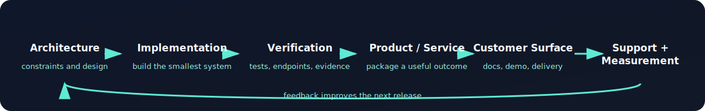

<h1 align="center">Scott Hardie</h1>

<strong>Solutions Architect · AI Systems Operator · Platform Builder</strong> 
I turn complex AI, SaaS, integration, and revenue workflows into systems people can operate.

  
  
  
  

Toronto, Canada · SaaS architecture · local-first AI · observability · automation · commercial systems

## What I build

- Local-first AI control planes, inference routing, and GPU workflows
- Reliable SaaS backends with auth, tenancy, billing, webhooks, and data integrity
- Integration and identity architectures for complex business systems
- Operator tooling that turns infrastructure into a repeatable service
- Proof-first productization: documentation, packaging, checkout, fulfillment, and support

## Technology stack — click a logo

  
  
  
  
  
  
  
  
  
  
  

## Start here

| If you want to… | Start with |
|---|---|
| See production-minded Python/API work | [llm-inference-api](https://github.com/Hardonian/llm-inference-api) · [ollama-router](https://github.com/Hardonian/ollama-router) |
| Explore AI workflow and image infrastructure | [comfyui-api](https://github.com/Hardonian/comfyui-api) · [Nautilus](https://github.com/Hardonian/Nautilus) |
| See finance, cost, and reconciliation systems | [Settler](https://github.com/Hardonian/Settler) · [TokenGoblin](https://github.com/Hardonian/TokenGoblin) |
| See enterprise architecture patterns | [identity-entitlement-broker](https://github.com/Hardonian/identity-entitlement-broker) · [enterprise-integration-fabric](https://github.com/Hardonian/enterprise-integration-fabric) · [golden-path-platform](https://github.com/Hardonian/golden-path-platform) |
| Browse applied research and experiments | [JupyterNotebooks](https://github.com/Hardonian/JupyterNotebooks) · [AI-Agent-Portfolio](https://github.com/Hardonian/AI-Agent-Portfolio) |
| See the customer-facing surface | [AI Automated Systems](https://www.aiautomatedsystems.ca) · [storefront](https://github.com/Hardonian/storefront) |

## The Platform

I operate a private, local-first AI lab and product platform. Its internal control plane, checkout API, audit API, compute lanes, and revenue database are intentionally private; the public profile links only to repositories and surfaces that visitors can actually open.

The operating loop is:

  

The design priorities are boring reliability, tenant and payment integrity, local privacy, observable operations, and small systems that reduce manual work.

## Public work by area

### AI and platform engineering

- [llm-inference-api](https://github.com/Hardonian/llm-inference-api) — OpenAI-compatible local inference gateway patterns
- [ollama-router](https://github.com/Hardonian/ollama-router) — multi-lane local model routing
- [Nautilus](https://github.com/Hardonian/Nautilus) — deterministic operational AI infrastructure concepts
- [comfyui-api](https://github.com/Hardonian/comfyui-api) — Cloudflare-facing ComfyUI integration work
- [ControlPlane](https://github.com/Hardonian/ControlPlane) — control-plane exploration and operator architecture

### Finance, cost, and reliability

- [Settler](https://github.com/Hardonian/Settler) — reconciliation intelligence for finance and operations
- [TokenGoblin](https://github.com/Hardonian/TokenGoblin) — AI spend and token-efficiency observability
- [finops-autopilot](https://github.com/Hardonian/finops-autopilot) — FinOps automation concepts
- [reliability-platform](https://github.com/Hardonian/reliability-platform) — reliability-oriented platform work
- [webhook-witness](https://github.com/Hardonian/webhook-witness) — webhook capture and inspection patterns

### Enterprise architecture

- [identity-entitlement-broker](https://github.com/Hardonian/identity-entitlement-broker) — identity, entitlements, and policy boundaries
- [enterprise-integration-fabric](https://github.com/Hardonian/enterprise-integration-fabric) — governed integration architecture
- [golden-path-platform](https://github.com/Hardonian/golden-path-platform) — developer-platform and delivery guardrails
- [commercial-architecture-simulator](https://github.com/Hardonian/commercial-architecture-simulator) — experimental commercial modeling
- [architecture-playbook](architecture-playbook/README.md) — reusable architecture delivery notes

## Productized workflow packs

These public pages describe real artifacts in this repository. Availability, pricing, and fulfillment state are kept on the product page rather than overstated in the profile.

| Pack | Use |
|---|---|
| [AI Command Center Setup](products/ai-command-center-setup.md) | Local operator-control-plane setup |
| [APVA AI ROI Benchmark](products/apva-roi-benchmark.md) | Reliability-adjusted workflow ROI analysis |
| [SaaS Repo Rescue Audit](products/repo-rescue-saas-audit.md) | Auth, billing, RLS, webhook, and deployment review |
| [Automation Retainer](products/automation-retainer.md) | Recurring workflow and operator support |
| [ComfyUI Workflow Packs](products/comfyui-workflow-packs.md) | Private local image-workflow assets |
| [Settler FinOps Engine](products/settler-finops-platform.md) | Reconciliation and audit-trail patterns |
| [TokenGoblin Cost Optimizer](products/tokengoblin-cost-optimizer.md) | LLM usage and routing cost controls |
| [Consent-based Voice Training Kit](products/ai-voice-clone-training-kit.md) | Adult, consensual, rights-aware voice workflows |

## How I work

1. Discover the actual system and constraints.
2. Fix the smallest root cause.
3. Keep private infrastructure private.
4. Verify with real tests, endpoints, assets, and logs.
5. Separate technical readiness from commercial proof.
6. Document rollback and the next highest-leverage action.

## Contact

- [LinkedIn](https://www.linkedin.com/in/scottrmhardie/)
- [AI Automated Systems](https://www.aiautomatedsystems.ca)
- [GitHub profile](https://github.com/Hardonian)
- [Email Scott](mailto:scottrmhardie@gmail.com)

> If you are building a serious AI, SaaS, integration, or operations system, start with a specific problem, a measurable outcome, and a verifiable path to production.
