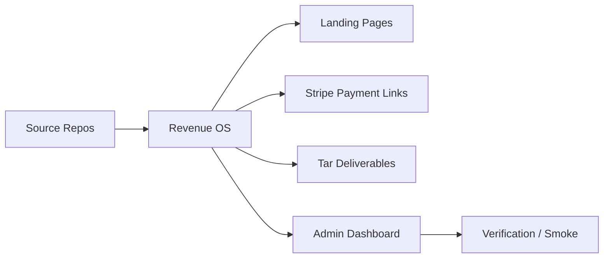
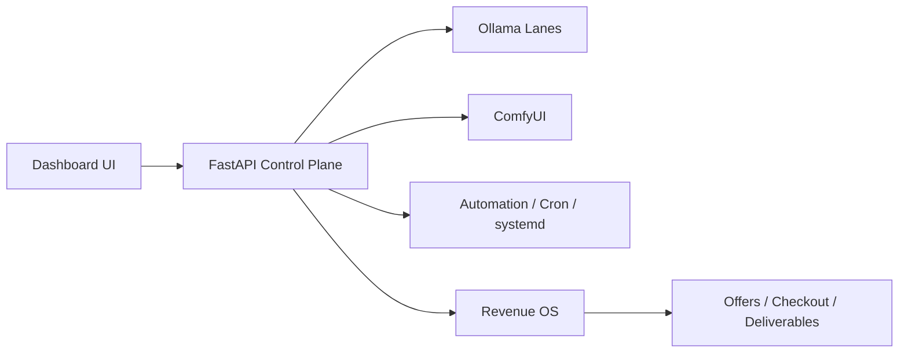

<h1 align="center">Scott Hardie</h1>

<h3 align="center">
Solutions Architect • AI Systems Operator • Platform Builder
</h3>

Solutions Architect @ <strong>McGraw Hill</strong> 
Ontario, Canada • SaaS Architecture • Local-First AI Infrastructure • Revenue Automation

<a href="#what-i-build">What I Build</a> •
<a href="#live-operator-managed-products">Live Products</a> •
<a href="#repositories">Repositories</a> •
<a href="#architecture-maps">Architecture Maps</a> •
<a href="#proficiencies">Proficiencies</a>

---

## What I Build

I build systems that sit between architecture and operations:
- local-first AI control planes
- multi-tenant SaaS and backend services
- workflow and observability tooling
- monetization infrastructure with checkout, landing pages, and deliverables
- operator dashboards that make internal systems sellable and supportable

Recent work has focused on turning private AI-lab tooling into a real operating surface: health, automation, product admin, checkout wiring, packaging, and proof-first delivery.

---

These are admin-managed through the **AI Lab Command Center / Revenue OS** dashboard. To reduce exposure, this README contains only offer summaries; every product links to a description page, and checkout links live on those product subpages, not here. If you want a link shortened/reviewed, open the linked page.

| Product | Headline | Price | Product Page | Checkout | Gumroad |
|---------|----------|-------|--------------|----------|---------|
| Local AI Lab Audit | Find and fix the hidden bottlenecks in your local AI lab in one day. | $499 fixed / $997 with implementation day | [Product page](products/local-ai-lab-audit.md) | Styled Stripe page in local-ai-lab-audit.md | Gumroad: `No` |
| AI Command Center Setup | A local dashboard that tells you what is broken, what to fix first, and what is making money. | $297 lifetime template / $29-mo managed checks / $997 done-for-you | [Product page](products/ai-command-center-setup.md) | Styled Stripe page in ai-command-center-setup.md | Gumroad: `No` |
| APVA AI ROI Benchmark | Stop guessing whether AI saves time. Measure True Value Yield. | $199 self-serve / $799 team benchmark | [Product page](products/apva-roi-benchmark.md) | Styled Stripe page in apva-roi-benchmark.md | Gumroad: `No` |
| ComfyUI Workflow Pack Shop | Sell repeatable private image pipelines instead of random prompt chaos. | $29 starter / $79 pro / $149 niche pack / $499 custom pack | [Product page](products/comfyui-workflow-packs.md) | Styled Stripe page in comfyui-workflow-packs.md | Gumroad: `No` |
| ComfyUI Node Starter Kit | A sellable starter template for shipping custom ComfyUI nodes without starting from zero. | $39 lite / $99 commercial | [Product page](products/comfyui-node-starter-kit.md) | Styled Stripe page in comfyui-node-starter-kit.md | Gumroad: `Yes` |
| ComfyUI Product Photo Kit | Generate clean ecommerce product shots locally with repeatable prompts and upscale flow. | $59 niche pack / $129 studio pack | [Product page](products/comfyui-product-photo-kit.md) | Styled Stripe page in comfyui-product-photo-kit.md | Gumroad: `Yes` |
| ComfyUI Fashion Lookbook Kit | Build stylized fictional lookbook imagery with repeatable composition and upscale passes. | $69 creator pack / $149 agency pack | [Product page](products/comfyui-fashion-lookbook-kit.md) | Styled Stripe page in comfyui-fashion-lookbook-kit.md | Gumroad: `Yes` |
| ComfyUI Thumbnail Creator Kit | Ship bold local thumbnail concepts with reusable prompt structures and upscale finishing. | $49 solo creator / $119 channel pack | [Product page](products/comfyui-thumbnail-creator-kit.md) | Styled Stripe page in comfyui-thumbnail-creator-kit.md | Gumroad: `Yes` |
| SaaS Repo Rescue Audit | Find the auth, billing, RLS, webhook, and deployment bugs before customers do. | $499 audit / $1500 fix sprint | [Product page](products/repo-rescue-saas-audit.md) | Styled Stripe page in repo-rescue-saas-audit.md | Gumroad: `No` |
| Local Automation Retainer | Turn repeated AI lab and business chores into boring verified automations. | $750-$2500/mo | [Product page](products/automation-retainer.md) | Styled Stripe page in automation-retainer.md | Gumroad: `No` |
| AI Character Generator Kit | Build consistent fictional characters for storytelling, comics, and RPGs. | $49 one-time | [Product page](products/ai-character-generator-kit.md) | Styled Stripe page in ai-character-generator-kit.md | Gumroad: `No` |
| Prompt Engineering Laboratory | Turn random prompting into precision results with lab-tested templates. | $39 one-time | [Product page](products/prompt-engineering-laboratory.md) | Styled Stripe page in prompt-engineering-laboratory.md | Gumroad: `No` |
| AI Video Storyboard Studio | Turn text prompts into viral-ready video storyboards with shot lists and pacing guides. | $79 one-time | [Product page](products/ai-video-storyboard-studio.md) | Styled Stripe page in ai-video-storyboard-studio.md | Gumroad: `No` |
| AI Voice Clone Training Kit | Train your own voice clone locally with consent-only workflows and audio processing. | $89 one-time | [Product page](products/ai-voice-clone-training-kit.md) | Styled Stripe page in ai-voice-clone-training-kit.md | Gumroad: `No` |
| Research Paper Visualizer | Convert academic papers into digestible visuals and explainer diagrams automatically. | $59 one-time | [Product page](products/research-paper-visualizer.md) | Styled Stripe page in research-paper-visualizer.md | Gumroad: `No` |
| Defend-Your-AI Legal Kit | Legal defensive security for AI products: privacy, model cards, and risk matrices. | $149 one-time | [Product page](products/defend-your-ai-legal-kit.md) | Styled Stripe page in defend-your-ai-legal-kit.md | Gumroad: `No` |
| Floyo Workflow Radar | See hidden workflow patterns, rank automation wins, and turn them into boring repeatable systems. | $149 pattern audit / $499 setup / $49-mo monitor | [Product page](products/floyo-workflow-radar.md) | Styled Stripe page in floyo-workflow-radar.md | Gumroad: `No` |
| Settler FinOps Reconciliation Engine | Automate payment reconciliation with deterministic matching and evidence-grade audit trails. | $2,500 self-serve / $10,000 enterprise setup / $500/mo managed | [Product page](products/settler-finops-platform.md) | Styled Stripe page in settler-finops-platform.md | Gumroad: `No` |
| TokenGoblin LLM Cost Optimizer | Stop LLM bill shock: real-time token measurement, smart routing, and cost optimization in one binary. | $1,499 self-serve / $5,000 enterprise / $299/mo managed | [Product page](products/tokengoblin-cost-optimizer.md) | Styled Stripe page in tokengoblin-cost-optimizer.md | Gumroad: `No` |
| AI Lab Applied Notebook Packs | Reproducible AI experiment packs - from notebook to production without the chaos. | $79 per pack / $299 bundle (5 packs) / $99/mo subscription | [Product page](products/ai-lab-notebook-packs.md) | Styled Stripe page in ai-lab-notebook-packs.md | Gumroad: `No` |
---------|-------|-------|--------------|--------||
|| Local Automation Retainer | Recurring local automation and operator support for teams with messy manual workflows. | $750-$2500/mo | [Buy](https://buy.stripe.com/8x2fZg0Ra6hS34C6atb3q0r) | — ||
|| SaaS Repo Rescue Audit | Auth, billing, RLS, webhook, and deployment audit for SaaS repos that need to stop pretending. | $499 audit / $1500 fix sprint | [Buy](https://buy.stripe.com/00wfZgfM4bCc9t0buNb3q0q) | — ||
|| Local AI Lab Audit | Private AI lab / workstation audit with remediation plan and optional implementation day. | $499 fixed / $997 with implementation day | [Buy](https://buy.stripe.com/7sYaEW9nG6hSdJggP7b3q0i) | — ||
|| AI Command Center Setup | Private AI workstation control plane template with optional managed checks or done-for-you setup. | $297 lifetime template / $29-mo managed checks / $997 done-for-you | [Buy](https://buy.stripe.com/9B68wO57qbCc7kSeGZb3q0j) | — ||
|| APVA AI ROI Benchmark | Reliability-adjusted AI workflow ROI scoring for teams validating automation investments. | $199 self-serve / $799 team benchmark | [Buy](https://buy.stripe.com/aFa28qeI08q0dJggP7b3q0k) | — ||
|| Floyo Workflow Radar | Workflow-pattern audit, setup, and monitoring to find repeatable automation wins. | $149 pattern audit / $499 setup / $49-mo monitor | [Buy](https://buy.stripe.com/9B66oG9nGdKk8oW42lb3q0y) | — ||
|| AI Character Generator Kit | Fictional character generation prompt/workflow kit. | $49 one-time | [Buy](https://buy.stripe.com/3cI8wO1Veay8fRo6atb3q0s) | — ||
|| AI Video Storyboard Studio | Storyboard planning assets for AI video workflows. | $79 one-time | [Buy](https://buy.stripe.com/9B65kCgQ8eOodJg6atb3q0u) | — ||
|| AI Voice Clone Training Kit | Training kit for safe, consent-based voice workflow setup. | $89 one-time | [Buy](https://buy.stripe.com/bJeeVc7fy35GgVs6atb3q0v) | — ||
|| ComfyUI Fashion Lookbook Kit | Fictional editorial lookbook workflow pack for private/local creative workflows. | $69 creator pack / $149 agency pack | [Buy](https://buy.stripe.com/dRm4gy6bu5dO48G7exb3q0o) | [Gumroad](https://scottrmhardie.gumroad.com/l/ictrbg) ||
|| ComfyUI Node Starter Kit | Starter scaffold for sellable ComfyUI custom node packs. | $39 lite / $99 commercial | [Buy](https://buy.stripe.com/9B6cN41Veay8eNkfL3b3q0m) | [Gumroad](https://scottrmhardie.gumroad.com/l/cauzzx) ||
|| ComfyUI Product Photo Kit | Repeatable ecommerce product image workflow kit. | $59 niche pack / $129 studio pack | [Buy](https://buy.stripe.com/cNibJ057q21C34C7exb3q0n) | [Gumroad](https://scottrmhardie.gumroad.com/l/cqfiev) ||
|| ComfyUI Thumbnail Creator Kit | Thumbnail generation workflow product for creators and channels. | $49 solo creator / $119 channel pack | [Buy](https://buy.stripe.com/00wcN443m7lW8oWbuNb3q0p) | [Gumroad](https://scottrmhardie.gumroad.com/l/bsjqfm) ||
|| ComfyUI Workflow Pack Shop | Productized private ComfyUI workflow packs for repeatable image generation pipelines. | $29 starter / $79 pro / $149 niche pack / $499 custom pack | [Buy](https://buy.stripe.com/3cIbJ0bvO6hS0WuaqJb3q0l) | — ||
|| Defend-Your-AI Legal Kit | Practical AI-use legal/readiness kit for small operators. | $149 one-time | [Buy](https://buy.stripe.com/9B600i1Ve8q020y0Q9b3q0x) | — ||
|| Prompt Engineering Laboratory | Prompt testing and iteration lab kit. | $39 one-time | [Buy](https://buy.stripe.com/fZufZg9nGbCc0WufL3b3q0t) | — ||
|| Research Paper Visualizer | Research-paper visual summary workflow kit. | $59 one-time | [Buy](https://buy.stripe.com/8x228qczS0Xy48G2Yhb3q0w) | — ||

---

## Latest Pushed Architecture / Platform Work

The newest public pushes on the profile now also include enterprise architecture and platform reference work beyond the AI-lab product line.

| Repo | Focus | State |
|------|-------|-------|
| [commercial-architecture-simulator](https://github.com/Hardonian/commercial-architecture-simulator) | Elixir-based commercial architecture simulator scaffold / experimental modeling repo | Early scaffold |
| [identity-entitlement-broker](https://github.com/Hardonian/identity-entitlement-broker) | Enterprise identity + entitlement broker with SSO, SCIM, tenant isolation, and OPA policy decisions | Active reference build |
| [enterprise-integration-fabric](https://github.com/Hardonian/enterprise-integration-fabric) | Governed integration layer for LMS, SIS, CRM, billing, identity, analytics, and support workflows | Active reference architecture |
| [golden-path-platform](https://github.com/Hardonian/golden-path-platform) | Internal developer platform / golden-path architecture for standardized service delivery and policy gates | Active reference architecture |
| [JupyterNotebooks](https://github.com/Hardonian/JupyterNotebooks) | Interactive notebooks, AI experiments, and applied workflow/tooling research | Active applied R&D |

These repos round out the profile beyond product SKUs: they show architecture depth in identity, integration, platform engineering, workflow simulation, and applied AI experimentation.

---

## Flagship Build: AI Lab Command Center

**What it is:** a local-first FastAPI dashboard and operator console for private AI infrastructure.

**What it manages:**
- Ollama multi-lane routing
- ComfyUI health and workflow surfaces
- GPU / disk / service truth
- self-heal and smoke checks
- Revenue OS product queue
- public offer + checkout routing
- deliverable and readiness state

**Why it matters:** it turns an internal AI workstation into a real, operator-grade product surface.

Repo: [Hardonian/ai-lab-command-center](https://github.com/Hardonian/ai-lab-command-center)

---

## Repositories

### AI Infrastructure & Operator Systems

| Repo | What It Does | Status | Stack |
|------|--------------|--------|-------|
| [ai-lab-command-center](https://github.com/Hardonian/ai-lab-command-center) | Local AI operator dashboard with Revenue OS, health, routing, smoke, and product admin | Running locally / active | FastAPI, Python, JS |
| [apva-framework](https://github.com/Hardonian/apva-framework) | Benchmarking framework for reliability-adjusted AI workflow ROI | Active / productized | Python, FastAPI |
| [floyo](https://github.com/Hardonian/floyo) | Workflow-pattern intelligence and automation discovery platform | Active / productized | Next.js, FastAPI, Supabase |
| [Keys](https://github.com/Hardonian/Keys) | Backendless CLI for structured AI asset packs and local workflows | Active | TypeScript, Node.js |

### Payments, Reconciliation & SaaS Systems

| Repo | What It Does | Status | Stack |
|------|--------------|--------|-------|
| [Settler](https://github.com/Hardonian/Settler) | Reconciliation intelligence system for finance and operations workflows | Active development | TypeScript, Node.js, PostgreSQL |
| [TokenGoblin](https://github.com/Hardonian/TokenGoblin) | Token usage measurement and routing/cost tooling for LLM workloads | Active development | Go, React, ClickHouse |
| [ai-lab-audit-api](https://github.com/Hardonian/ai-lab-audit-api) | Local-first AI-lab audit API with reports and checkout flow | Live-ready | FastAPI, Python, Stripe |

### Webhook / Infra / Platform Tooling

| Repo | What It Does | Status | Stack |
|------|--------------|--------|-------|
| [webhook-witness](https://github.com/Hardonian/webhook-witness) | Capture, inspect, and replay webhook traffic | Deployed / phase 2 | Cloudflare Workers, D1 |
| [api-changelog-radar](https://github.com/Hardonian/api-changelog-radar) | API changelog monitoring scaffold | Proof-of-concept | Cloudflare Workers, D1 |
| [tfstate-drift-inspector](https://github.com/Hardonian/tfstate-drift-inspector) | Terraform drift scanning and alerting | Experimental | Python, Docker |
| [cloudflare-app-ops-dashboard](https://github.com/Hardonian/cloudflare-app-ops-dashboard) | Portfolio status board for Cloudflare services | Deployed | TypeScript, Workers |

---

## Architecture Maps

### Operator Revenue Surface

### Private AI Lab Control Plane

### Reconciliation / Financial Systems Pattern

---

## Proficiencies

| Area | Notes |
|------|-------|
| Solution architecture | SaaS workflows, integration design, stakeholder translation |
| AI platform operations | local-first inference, routing, workflow systems, operator control |
| Backend systems | FastAPI, Node.js, REST APIs, webhooks, service hardening |
| Revenue infrastructure | Stripe checkout, landing flows, packaging, monetization ops |
| Data systems | PostgreSQL, Redis, SQLite, Supabase, ClickHouse |
| Automation | cron, systemd, smoke testing, verification-led delivery |
| Frontend/admin surfaces | dashboard UX, product admin, operator consoles |

---

## Technical Surface

**Primary:** Python, TypeScript, SQL, Bash, JavaScript  
**Infrastructure:** FastAPI, Next.js, PostgreSQL, Redis, SQLite, Supabase, Cloudflare  
**AI:** Ollama, ComfyUI, local GPU workflows  
**Execution style:** verification-first, low-bloat, operator-grade

---

## Background

- Solutions Architect at **McGraw Hill**
- 15+ years across **McGraw Hill** and **Pearson**
- Strong mix of technical architecture, commercial execution, and operator thinking
- Recent focus: building systems that connect internal tooling to revenue, not just demos

---

*If you want to collaborate, the best starting points are [Settler](https://github.com/Hardonian/Settler) and [ai-lab-command-center](https://github.com/Hardonian/ai-lab-command-center).*