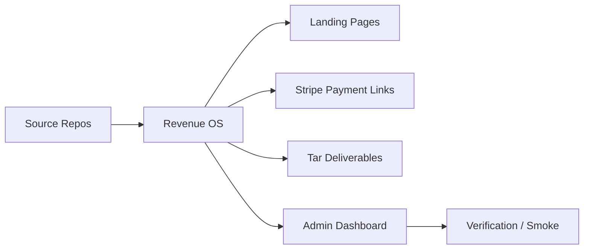
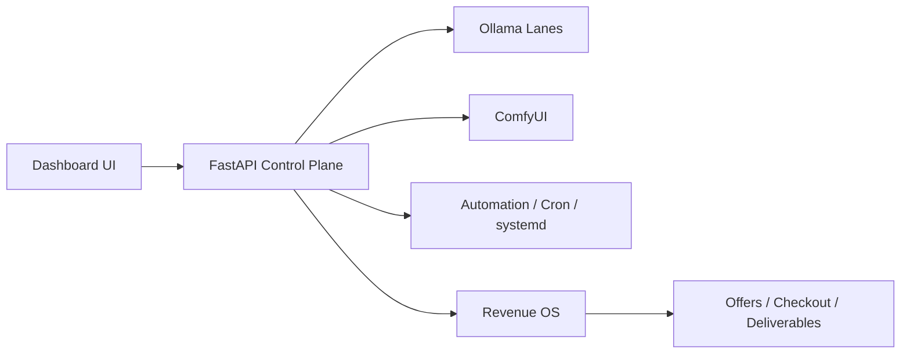
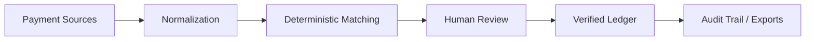

<h1 align="center">Scott Hardie</h1>

<h3 align="center">
Solutions Architect • AI Systems Operator • Platform Builder
</h3>

Solutions Architect @ <strong>McGraw Hill</strong> 
Ontario, Canada • SaaS Architecture • Local-First AI Infrastructure • Revenue Automation

<a href="#what-i-build">What I Build</a> •
<a href="#live-operator-managed-products">Live Products</a> •
<a href="#repositories">Repositories</a> •
<a href="#architecture-maps">Architecture Maps</a> •
<a href="#proficiencies">Proficiencies</a>

---

## What I Build

I build systems that sit between architecture and operations:
- local-first AI control planes
- multi-tenant SaaS and backend services
- workflow and observability tooling
- monetization infrastructure with checkout, landing pages, and deliverables
- operator dashboards that make internal systems sellable and supportable

Recent work has focused on turning private AI-lab tooling into a real operating surface: health, automation, product admin, checkout wiring, packaging, and proof-first delivery.

---

## Live Operator-Managed Products

These are now admin-managed through the **AI Lab Command Center / Revenue OS** dashboard with checkout, landing pages, and deliverable tracking.

| Product | Offer | State |
|---------|-------|-------|
| APVA AI ROI Benchmark | Reliability-adjusted AI workflow ROI scoring | Live |
| AI Command Center Setup | Private AI workstation control plane template | Live |
| Floyo Workflow Radar | Workflow-pattern audit / setup / monitor | Live |
| Local AI Lab Audit | Private AI lab audit + remediation offer | Live |
| SaaS Repo Rescue Audit | Auth / billing / RLS / webhook repo audit | Live |
| Local Automation Retainer | Recurring automation + operator support | Live |
| ComfyUI Workflow Packs | Productized private image workflow bundles | Live |
| ComfyUI Node Starter Kit | Sellable node-pack scaffold | Live |
| ComfyUI Product Photo Kit | Repeatable ecommerce imaging workflow | Live |
| ComfyUI Fashion Lookbook Kit | Fictional editorial lookbook workflow pack | Live |
| ComfyUI Thumbnail Creator Kit | Thumbnail generation workflow product | Live |

---

## Flagship Build: AI Lab Command Center

**What it is:** a local-first FastAPI dashboard and operator console for private AI infrastructure.

**What it manages:**
- Ollama multi-lane routing
- ComfyUI health and workflow surfaces
- GPU / disk / service truth
- self-heal and smoke checks
- Revenue OS product queue
- public offer + checkout routing
- deliverable and readiness state

**Why it matters:** it turns an internal AI workstation into a real, operator-grade product surface.

Repo: [Hardonian/ai-lab-command-center](https://github.com/Hardonian/ai-lab-command-center)

---

## Repositories

### AI Infrastructure & Operator Systems

| Repo | What It Does | Status | Stack |
|------|--------------|--------|-------|
| [ai-lab-command-center](https://github.com/Hardonian/ai-lab-command-center) | Local AI operator dashboard with Revenue OS, health, routing, smoke, and product admin | Running locally / active | FastAPI, Python, JS |
| [apva-framework](https://github.com/Hardonian/apva-framework) | Benchmarking framework for reliability-adjusted AI workflow ROI | Active / productized | Python, FastAPI |
| [floyo](https://github.com/Hardonian/floyo) | Workflow-pattern intelligence and automation discovery platform | Active / productized | Next.js, FastAPI, Supabase |
| [Keys](https://github.com/Hardonian/Keys) | Backendless CLI for structured AI asset packs and local workflows | Active | TypeScript, Node.js |

### Payments, Reconciliation & SaaS Systems

| Repo | What It Does | Status | Stack |
|------|--------------|--------|-------|
| [Settler](https://github.com/Hardonian/Settler) | Reconciliation intelligence system for finance and operations workflows | Active development | TypeScript, Node.js, PostgreSQL |
| [TokenGoblin](https://github.com/Hardonian/TokenGoblin) | Token usage measurement and routing/cost tooling for LLM workloads | Active development | Go, React, ClickHouse |
| [ai-lab-audit-api](https://github.com/Hardonian/ai-lab-audit-api) | Local-first AI-lab audit API with reports and checkout flow | Live-ready | FastAPI, Python, Stripe |

### Webhook / Infra / Platform Tooling

| Repo | What It Does | Status | Stack |
|------|--------------|--------|-------|
| [webhook-witness](https://github.com/Hardonian/webhook-witness) | Capture, inspect, and replay webhook traffic | Deployed / phase 2 | Cloudflare Workers, D1 |
| [api-changelog-radar](https://github.com/Hardonian/api-changelog-radar) | API changelog monitoring scaffold | Proof-of-concept | Cloudflare Workers, D1 |
| [tfstate-drift-inspector](https://github.com/Hardonian/tfstate-drift-inspector) | Terraform drift scanning and alerting | Experimental | Python, Docker |
| [cloudflare-app-ops-dashboard](https://github.com/Hardonian/cloudflare-app-ops-dashboard) | Portfolio status board for Cloudflare services | Deployed | TypeScript, Workers |

---

## Architecture Maps

### Operator Revenue Surface

### Private AI Lab Control Plane

### Reconciliation / Financial Systems Pattern

---

## Proficiencies

| Area | Notes |
|------|-------|
| Solution architecture | SaaS workflows, integration design, stakeholder translation |
| AI platform operations | local-first inference, routing, workflow systems, operator control |
| Backend systems | FastAPI, Node.js, REST APIs, webhooks, service hardening |
| Revenue infrastructure | Stripe checkout, landing flows, packaging, monetization ops |
| Data systems | PostgreSQL, Redis, SQLite, Supabase, ClickHouse |
| Automation | cron, systemd, smoke testing, verification-led delivery |
| Frontend/admin surfaces | dashboard UX, product admin, operator consoles |

---

## Technical Surface

**Primary:** Python, TypeScript, SQL, Bash, JavaScript  
**Infrastructure:** FastAPI, Next.js, PostgreSQL, Redis, SQLite, Supabase, Cloudflare  
**AI:** Ollama, ComfyUI, local GPU workflows  
**Execution style:** verification-first, low-bloat, operator-grade

---

## Background

- Solutions Architect at **McGraw Hill**
- 15+ years across **McGraw Hill** and **Pearson**
- Strong mix of technical architecture, commercial execution, and operator thinking
- Recent focus: building systems that connect internal tooling to revenue, not just demos

---

*If you want to collaborate, the best starting points are [Settler](https://github.com/Hardonian/Settler) and [ai-lab-command-center](https://github.com/Hardonian/ai-lab-command-center).*