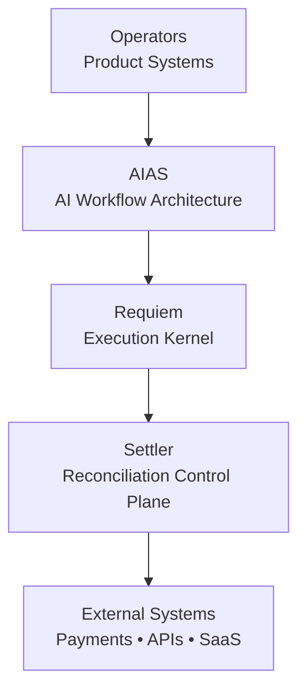
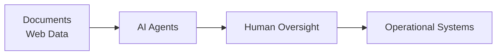
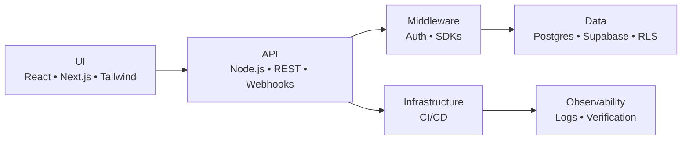

<!-- ========================================================= -->
<!-- HERO -->
<!-- ========================================================= -->

<h1 align="center">Scott Hardie</h1>

<h3 align="center">
Technical Product Manager • Solutions Architect • Platform Systems
</h3>

<em>Designing operational platforms where architecture, product, and automation intersect.</em>

Solutions Architect @ <strong>McGraw Hill</strong> 
Canada • Platform Architecture • SaaS Systems • Automation Infrastructure

---

# Overview

I build systems that sit at the intersection of:

**product direction → platform architecture → operational automation**

These systems often involve:

- distributed integrations
- SaaS platforms
- automation pipelines
- reconciliation and operational tooling

The goal is to build systems that remain:

- observable
- reliable
- traceable
- operationally clear

Many systems must function in messy real-world environments, not controlled demos.

---

# Core Platform Systems

| System | Role |
|------|------|
| **AIAS** | AI workflow architecture |
| **Requiem** | deterministic execution kernel |
| **Settler** | reconciliation control plane |

---

# Platform Relationship

---

# Settler Architecture

Settler explores how reconciliation workflows can move from manual processes toward deterministic automation.

Goals:

- deterministic matching logic
- auditability
- traceable financial workflows
- human review checkpoints

---

# Requiem Architecture

Requiem explores traceable execution systems for automation and orchestration.

Focus areas:

- deterministic workflows
- execution traceability
- governance layers
- reproducible automation

---

# AIAS Architecture

Goal:

AI systems that remain **observable, governable, and operationally safe**.

---

# Platform Stack

---

# Technical Surface

Primary languages:

- TypeScript / JavaScript
- Python
- SQL
- Go
- HTML
- CSS
- Bash

Systems familiarity:

- Rust
- C++

Execution environments
- WebAssembly (WASM)
- Node.js
- Deno
- Bun

---

# Capabilities

| Domain | Areas |
|------|------|
| Frontend | React, Next.js, Tailwind |
| Backend | Node APIs, REST services |
| Data | Postgres, Supabase, RLS |
| Integration | OAuth, SaaS APIs |
| Automation | AI workflows |
| DevOps | GitHub Actions |
| Security | Auth layers, tenant isolation |
| Performance | Core Web Vitals |
| Accessibility | WCAG design |
| Growth | CRO-aware UX |

---

# Platform Concerns

Operational systems require attention to:

- authentication boundaries
- tenant isolation
- webhook verification
- secrets management
- audit logging
- failure visibility

Systems should **fail predictably and recover safely**.

---

# Delivery

Delivery workflows typically include:

- CI pipelines
- regression testing
- smoke tests
- reproducible builds
- staged deployments

Operational reliability is treated as **product quality**.

---

# Additional Projects

- Hardonia — ecommerce automation experiments
- AI-Agent-Portfolio — applied AI workflow systems
- hardonia-intel-scraper — research automation

---

# Operating Principles

Guidelines that shape most systems I design:

- reduce complexity before automating it
- prefer observable systems over opaque abstractions
- design for degraded states
- keep humans in the loop where judgment matters
- build systems that survive real-world conditions

If a system cannot be debugged, explained, or recovered, it probably is not ready to ship.

---

