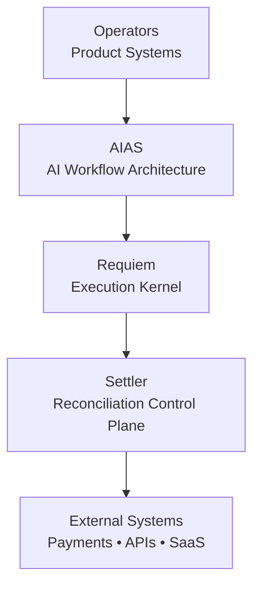
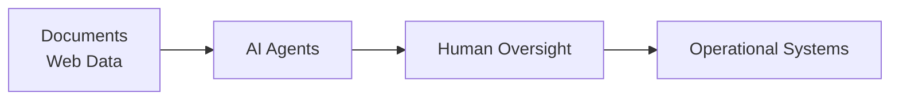
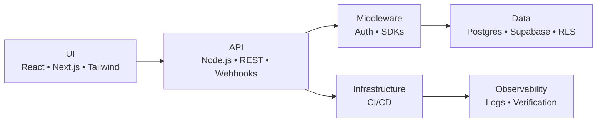

<!-- ========================================================= -->
<!-- HERO -->
<!-- ========================================================= -->

<h1 align="center">Scott Hardie</h1>

<h3 align="center">
Technical Product Manager • Solutions Architect • Platform Systems
</h3>

<em>Designing operational platforms where architecture, product, and automation intersect.</em>

Solutions Architect @ <strong>McGraw Hill</strong> 
Canada • Platform Architecture • SaaS Systems • Automation Infrastructure

---

## Overview

I build systems at the intersection of:

**product direction → platform architecture → operational automation**

My focus is on systems that remain:

- observable
- reliable
- traceable
- operationally clear

I optimize for real operations, not demo environments.

---

## Core Platform Systems

| System | Role |
|------|------|
| **AIAS** | AI workflow architecture |
| **Requiem** | deterministic execution kernel |
| **Settler** | reconciliation control plane |

---

## Platform Relationship

---

## Featured Projects

| Project | What it does | Focus |
|------|------|------|
| [Settler](https://github.com/Hardonian/Settler) | Resend-style payment reconciliation API for developers | Deterministic matching, auditability |
| [Requiem](https://github.com/Hardonian/Requiem) | Unified AI control plane (kernel + policy + web) | Governance, orchestration, traceability |
| [ControlPlane](https://github.com/Hardonian/ControlPlane) | Execution engine for agent-driven systems | Reliable automation at scale |
| [ReadyLayer](https://github.com/Hardonian/ReadyLayer) | Review/test/document AI-generated code before merge | CI-integrated code governance |
| [JobForge](https://github.com/Hardonian/JobForge) | Postgres-native, language-agnostic job orchestrator | Idempotency, retries, RPC-first design |
| [castor](https://github.com/Hardonian/castor) | Podcast sponsor analytics + ROI attribution stack | Ingestion pipelines, reporting systems |
| [truthcore](https://github.com/Hardonian/truthcore) | Deterministic verification platform | Reproducibility, anomaly detection |

---

## Proficiencies

| Area | Proficiency |
|------|------|
| Platform architecture | Advanced |
| SaaS systems (multi-tenant) | Advanced |
| API/backend systems (Node/REST/Webhooks) | Advanced |
| Frontend product systems (React/Next.js) | Advanced |
| Data systems (Postgres/Supabase/RLS) | Advanced |
| AI workflow automation | Advanced |
| CI/CD and delivery engineering | Advanced |
| Security boundaries (auth, tenant isolation) | Advanced |
| Performance and web quality (CWV) | Strong |
| Accessibility (WCAG-aware delivery) | Strong |

---

## Architecture Deep Dives

### Settler Architecture

Goals:

- deterministic matching logic
- auditability
- traceable financial workflows
- human review checkpoints

### Requiem Architecture

Focus areas:

- deterministic workflows
- execution traceability
- governance layers
- reproducible automation

### AIAS Architecture

Goal:

AI systems that remain **observable, governable, and operationally safe**.

---

## Platform Stack

---

## Technical Surface

**Primary:** TypeScript/JavaScript, Python, SQL, Go, HTML/CSS, Bash  
**Systems familiarity:** Rust, C++  
**Execution environments:** WebAssembly (WASM), Node.js, Deno, Bun

---

## Operating Principles

- reduce complexity before automating it
- prefer observable systems over opaque abstractions
- design for degraded states
- keep humans in the loop where judgment matters
- build systems that survive real-world conditions

If a system cannot be debugged, explained, or recovered, it probably is not ready to ship.

---

