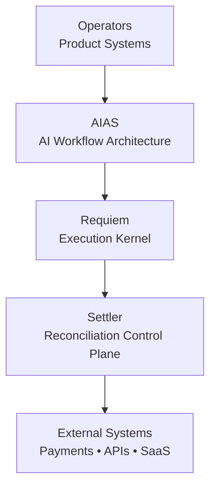
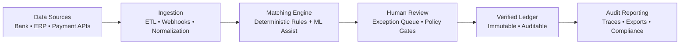
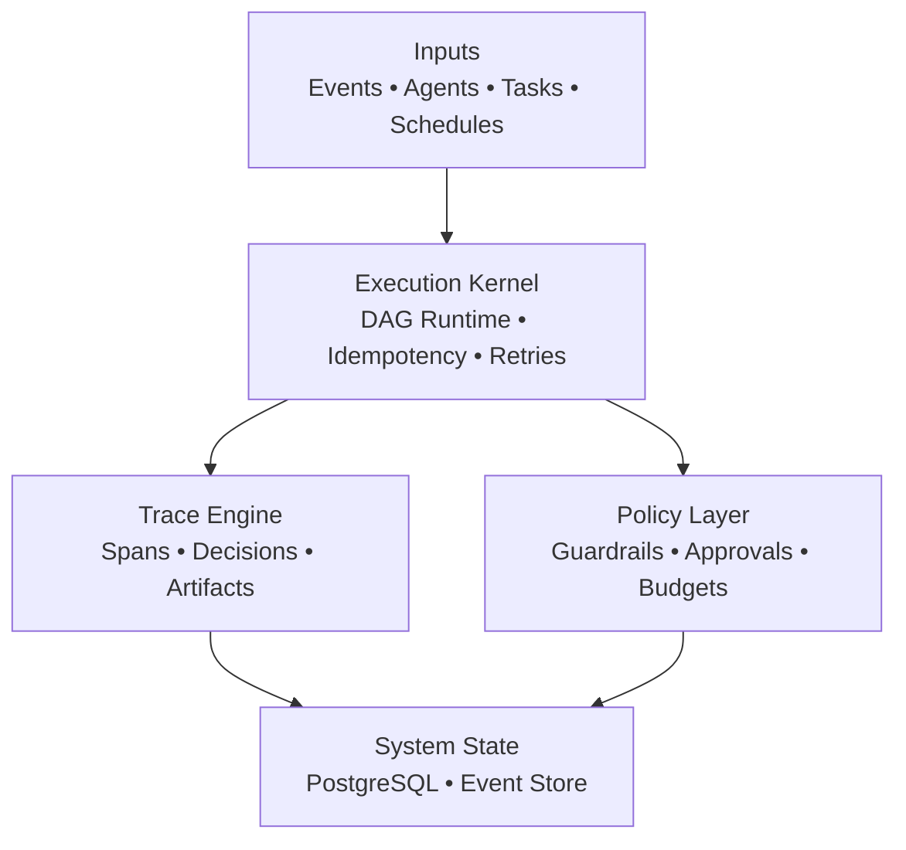
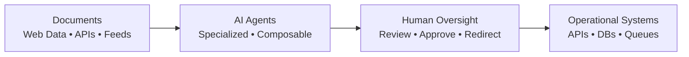
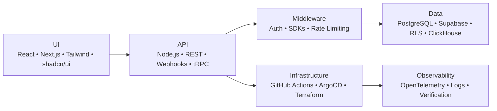

<!-- ========================================================= -->
<!-- HERO -->
<!-- ========================================================= -->

<h1 align="center">Scott Hardie</h1>

<h3 align="center">
Technical Product Manager • Solutions Architect • Platform Systems
</h3>

<em>Designing operational platforms where architecture, product, and automation intersect.</em>

Solutions Architect @ <strong>McGraw Hill</strong> 
Canada • Platform Architecture • SaaS Systems • Automation Infrastructure

<a href="#overview">Overview</a> •
<a href="#featured-projects">Featured Projects</a> •
<a href="#active-systems">Active Systems</a> •
<a href="#proficiencies">Proficiencies</a> •
<a href="#architecture-deep-dives">Architecture</a> •
<a href="#operating-principles">Principles</a> •
<a href="#collaboration">Collaboration</a>

---

## Overview

I build systems at the intersection of:

**product direction → platform architecture → operational automation**

My focus is on systems that are:

- **Observable** — telemetry, traces, and audit trails built in
- **Reliable** — designed for degraded states and partial failures
- **Traceable** — every decision reconstructable from logs
- **Operationally clear** — runbooks, not runaway automation

I optimize for real operations, not demo environments.

**Current focus:** deterministic AI execution, reconciliation infrastructure, and governance-first automation.

## Strategic Snapshot

- Building platform systems that prioritize explainability and operational safety
- Designing automation that remains deterministic under production stress
- Integrating product delivery with governance, policy, and auditability from day one

## Why Teams Bring Me In

- When systems are growing fast but operational risk is rising
- When automation exists but reliability, traceability, or governance is weak
- When product, architecture, and execution need to align under one operating model

---

## Core Platform Systems

| System | Role | Status |
|------|------|--------|
| **AIAS** | AI workflow architecture — document ingestion, agent orchestration, human oversight | Active |
| **Requiem** | Unified AI control plane (kernel + policy + web UI) — governance, orchestration, traceability | Active |
| **Settler** | Reconciliation control plane — deterministic matching, audit trails, human review checkpoints | Active |

---

## Platform Relationship

---

## Featured Projects

> Selected projects that best represent my architecture and operating model.

Tip: Start with <strong>Requiem + Settler</strong> for the clearest view of my governance-first systems approach.

| Project | What it does | Focus | Stack |
|------|------|------|------|
| **[Requiem](https://github.com/Hardonian/Requiem)** | Unified AI control plane — kernel, policy engine, web UI. Centralized governance for AI workflows with full traceability. | Governance, orchestration, traceability, reproducible execution | TypeScript, Node.js, React, PostgreSQL |
| **[Settler](https://github.com/Hardonian/Settler)** | Resend-style payment reconciliation API for developers. Deterministic matching engine with human review gates and full audit logs. | Deterministic matching, auditability, financial workflow traceability | Node.js, TypeScript, PostgreSQL, Prisma |
| **[ControlPlane](https://github.com/Hardonian/ControlPlane)** | Execution engine for agent-driven systems. Reliable automation at scale with idempotency, retries, and policy enforcement. | Reliable automation, idempotency, policy-guarded execution | TypeScript, Node.js, PostgreSQL |
| **[ReadyLayer](https://github.com/Hardonian/ReadyLayer)** | CI-integrated code governance — review, test, and document AI-generated code before merge. Quality gates for generated code. | Code governance, CI integration, AI code verification | TypeScript, GitHub Actions, Node.js |
| **[JobForge](https://github.com/Hardonian/JobForge)** | Postgres-native, language-agnostic job orchestrator. Idempotency keys, exponential backoff, RPC-first design. | Job orchestration, idempotency, retries, observability | Go, PostgreSQL, SQL |
| **[castor](https://github.com/Hardonian/castor)** | Podcast sponsor analytics + ROI attribution stack. Ingestion pipelines, normalization, reporting dashboards. | Data pipelines, attribution modeling, reporting systems | Python, PostgreSQL, Apache Airflow |
| **[truthcore](https://github.com/Hardonian/truthcore)** | Deterministic verification platform. Reproducible builds, anomaly detection, supply-chain verification. | Reproducibility, anomaly detection, verification | Rust, Go, WebAssembly |

**What this portfolio emphasizes:** systems that can be operated, audited, and evolved safely under real production constraints.

---

## Active Systems (Extended Portfolio)

> Additional production systems in active development — each addressing a specific operational domain.

| System | Domain | Description | Key Tech |
|------|--------|-------------|----------|
| **[AI-Automated-Systems (AIAS)](https://github.com/Hardonian/AI-Automated-Systems_AIAS)** | AI Workflow Architecture | Document ingestion → agent orchestration → human oversight → operational output. Multi-agent pipelines with policy gates. | TypeScript, React, Node.js, PostgreSQL, LangGraph |
| **[EvidenceVault](https://github.com/Hardonian/EvidenceVault)** | Compliance & Audit | Immutable evidence store with cryptographic verification. WORM storage, Merkle proofs, regulatory export packs. | Go, PostgreSQL, WASM, OpenTelemetry |
| **[MissionLedger](https://github.com/Hardonian/MissionLedger)** | Operational Ledger | Double-entry ledger for operational events. Idempotent writes, temporal queries, audit-grade immutability. | Rust, PostgreSQL, SQLx |
| **[Nautilus](https://github.com/Hardonian/Nautilus)** | Operator Substrate | Kubernetes-native operator framework. Reconciliation loops, CRD management, multi-cluster governance. | Go, controller-runtime, Helm, CUE |
| **[TokenGoblin](https://github.com/Hardonian/TokenGoblin)** | Token Efficiency | LLM token measurement & optimization. Prompt compression, routing, cost attribution per tenant/feature. | Go, React, TypeScript, ClickHouse |
| **[FindingNemos](https://github.com/Hardonian/FindingNemos)** | Reconciliation Intelligence | Transaction matching with ML-assisted rules. Deterministic core + human-in-the-loop exception handling. | Zig, TypeScript, PostgreSQL |
| **[MEL / MeshEdgeLayer](https://github.com/Hardonian/MeshEdgeLayer)** | Edge Coordination | Distributed coordination layer for edge workloads. Conflict-free replication, offline-first sync. | Rust, CRDTs, WebRTC, WASM |

---

## Proficiencies

| Area | Proficiency | Notes |
|------|------|-------|
| Platform architecture | Advanced | Multi-tenant SaaS, operator patterns, control planes |
| SaaS systems (multi-tenant) | Advanced | RLS, tenant isolation, billing integration |
| API/backend systems (Node/REST/Webhooks) | Advanced | Idempotency, versioning, observability |
| Frontend product systems (React/Next.js) | Advanced | CWV optimization, accessibility, design systems |
| Data systems (Postgres/Supabase/RLS) | Advanced | Partitioning, read replicas, row-level security |
| AI workflow automation | Advanced | Governance layers, deterministic execution, human gates |
| CI/CD and delivery engineering | Advanced | GitHub Actions, ArgoCD, verification matrices |
| Security boundaries (auth, tenant isolation) | Advanced | OAuth2/OIDC, mTLS, capability-based auth |
| Performance and web quality (CWV) | Strong | LCP/CLS/INP optimization, bundle analysis |
| Accessibility (WCAG-aware delivery) | Strong | Semantic HTML, ARIA, focus management |

## Outcomes I Optimize For

- Faster delivery **without** sacrificing governance
- Deterministic execution **over** brittle automation
- Auditable operations with clear failure paths
- Practical architecture that supports product velocity

## Production-Grade Defaults

- Explicit policy + guardrail layers before autonomy
- Observability designed in (not retrofitted)
- Reproducible deployment and verification workflows
- Human escalation paths for high-risk decisions

---

## Architecture Deep Dives

### Settler Architecture

**Goals:**

- Deterministic matching logic with configurable rules
- Full auditability — every match traceable to source
- Traceable financial workflows with human checkpoints
- Extensible for new payment rails and data formats

### Requiem Architecture

**Focus areas:**

- Deterministic workflows with replay capability
- Execution traceability — every decision logged
- Governance layers: policies, budgets, approval gates
- Reproducible automation via event sourcing

### AIAS Architecture

**Goal:** AI systems that remain **observable, governable, and operationally safe**.

---

## Platform Stack

---

## Technical Surface

**Primary:** TypeScript/JavaScript, Python, SQL, Go, HTML/CSS, Bash  
**Systems familiarity:** Rust, C++, Zig  
**Execution environments:** WebAssembly (WASM), Node.js, Deno, Bun  
**Infrastructure:** Kubernetes, PostgreSQL, Redis, ClickHouse, Supabase  
**AI/ML:** LangGraph, OpenTelemetry, custom agent runtimes

---

## Operating Principles

- **Reduce complexity before automating it** — automation codifies; don't codify chaos
- **Prefer observable systems over opaque abstractions** — if you can't trace it, you can't trust it
- **Design for degraded states** — partial failure is the normal case
- **Keep humans in the loop where judgment matters** — approval gates, not just notifications
- **Build systems that survive real-world conditions** — network partitions, clock skew, bad inputs

If a system cannot be debugged, explained, or recovered, it probably is not ready to ship.

## Collaboration

If you're building platform-heavy products or AI-enabled operational systems, I'm always open to exchanging architecture notes and practical implementation patterns.

## Contact

- GitHub discussions/issues on relevant repos
- Connect here: [github.com/Hardonian](https://github.com/Hardonian)

## Profile Changelog

- **v1:** clarity and structure upgrade
- **v2:** narrative + credibility polish
- **v3:** production-grade framing, scanability, and strategic positioning
- **v4:** conversion optimization, decision-context framing, and collaboration pathing
- **v5:** extended active systems, deeper repo details, architecture diagrams, technical surface expansion

---

