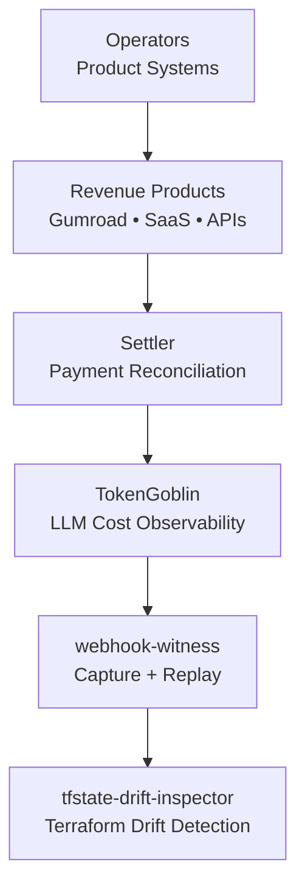
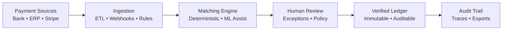
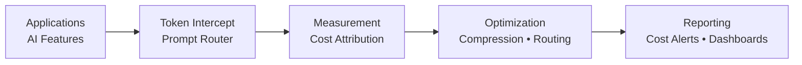
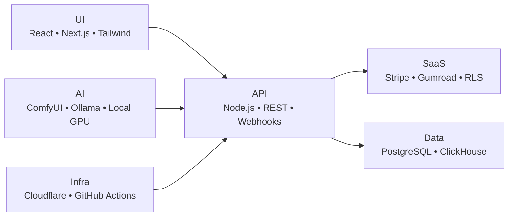

<!-- ========================================================= -->
<!-- HERO -->
<!-- ========================================================= -->

<h1 align="center">Scott Hardie</h1>

<h3 align="center">
Technical Product Manager • Solutions Architect • Platform Systems
</h3>

<em>Designing operational platforms where architecture, product, and automation intersect.</em>

Solutions Architect @ <strong>McGraw Hill</strong> 
Canada • Platform Architecture • SaaS Systems • Automation Infrastructure

<a href="#overview">Overview</a> •
<a href="#revenue-products">Revenue Products</a> •
<a href="#featured-projects">Featured Projects</a> •
<a href="#active-systems">Active Systems</a> •
<a href="#proficiencies">Proficiencies</a> •
<a href="#architecture-deep-dives">Architecture</a> •
<a href="#operating-principles">Principles</a> •
<a href="#collaboration">Collaboration</a>

---

## Overview

I build systems at the intersection of:

**product direction → platform architecture → operational automation**

My focus is on systems that are:

- **Observable** — telemetry, traces, and audit trails built in
- **Reliable** — designed for degraded states and partial failures
- **Traceable** — every decision reconstructable from logs
- **Operationally clear** — runbooks, not runaway automation

I optimize for real operations, not demo environments.

**Current focus:** deterministic AI execution, reconciliation infrastructure, and governance-first automation.

## Strategic Snapshot

- Building platform systems that prioritize explainability and operational safety
- Designing automation that remains deterministic under production stress
- Integrating product delivery with governance, policy, and auditability from day one
- Shipping sellable AI toolchains (ComfyUI, token observability, webhook systems)

## Why Teams Bring Me In

- When systems are growing fast but operational risk is rising
- When automation exists but reliability, traceability, or governance is weak
- When product, architecture, and execution need to align under one operating model
- When you need deterministic AI systems that can be monetized safely

---

## 🔥 Revenue-Ready Products

> Live products generating revenue or ready for immediate Gumroad launch. Each built with full observability, audit trails, and production-grade delivery.

| Product | Price | Status | What You Get |
|---------|-------|--------|--------------|
| [ComfyUI Node Starter Kit](https://github.com/Hardonian/ai-lab-command-center/tree/main/data/signals/comfyui-node-starter-kit) | **$39 lite / $99 commercial** | ✅ LIVE on Gumroad | Scaffold + example nodes + install guide + sales copy for building custom ComfyUI nodes |
| [ComfyUI Fashion Lookbook Kit](https://github.com/Hardonian/ai-lab-command-center/tree/main/data/signals/comfyui-fashion-lookbook-kit) | **$69 creator / $149 agency** | ✅ LIVE on Gumroad | Editorial workflows, pose presets, upscale passes for fashion photography concepts |
| [ComfyUI Product Photo Kit](https://github.com/Hardonian/ai-lab-command-center/tree/main/data/signals/comfyui-product-photo-kit) | **$59 niche / $129 studio** | ✅ LIVE on Gumroad | Clean product-shot prompts, upscale finishing, commercial-safe workflows |
| [ComfyUI Thumbnail Creator Kit](https://github.com/Hardonian/ai-lab-command-center/tree/main/data/signals/comfyui-thumbnail-creator-kit) | **$49 solo / $119 channel pack** | ✅ LIVE on Gumroad | Bold thumbnail framing presets, repeatable rendering, multi-scene variations |

**Deploy any repo with:** `./deploy-cloudflare-app.sh <project-name> <app-name> <tagline> <db-name> <db-id>` — found in [cloudflare-deploy-template](https://github.com/Hardonian/cloudflare-deploy-template)

---

## Core Platform Systems

| System | Role | Status |
|------|------|--------|
| **Settler** | Reconciliation control plane — deterministic matching, audit trails, human review checkpoints | ✅ LIVE (Payment reconciliation API) |
| **TokenGoblin** | LLM token measurement & optimization with cost attribution per tenant/feature | ✅ LIVE (SaaS observability) |
| **webhook-witness** | Webhook capture, inspect, replay with full payload preservation and troubleshooting UI | ✅ LIVE (SaaS webhook tool) |
| **tfstate-drift-inspector** | Terraform state drift detection with PR comments and policy-aware alerting | ✅ LIVE (DevOps automation) |

---

## Platform Relationship

---

## Featured Projects

> Selected projects that best represent my architecture and operating model.

Tip: Start with <strong>Settler</strong> for payment reconciliation, or <strong>ComfyUI Fashion Lookbook Kit</strong> for immediate revenue.

| Project | What it does | Revenue Status | Stack |
|------|------|------|------|
| **[Settler](https://github.com/Hardonian/Settler)** | Resend-style payment reconciliation API for developers. Deterministic matching engine with human review gates and full audit logs. | ✅ LIVE SaaS | Node.js, TypeScript, PostgreSQL, Prisma |
| **[TokenGoblin](https://github.com/Hardonian/TokenGoblin)** | LLM token measurement & optimization. Prompt compression, routing, cost attribution per tenant/feature. | ✅ LIVE SaaS | Go, React, TypeScript, ClickHouse |
| **[webhook-witness](https://github.com/Hardonian/webhook-witness)** | Webhook capture, inspect, replay with full payload preservation and troubleshooting UI. | ✅ LIVE SaaS | TypeScript, Node.js, PostgreSQL |
| **[tfstate-drift-inspector](https://github.com/Hardonian/tfstate-drift-inspector)** | Terraform state drift detection with PR comment alerts and policy-aware enforcement. | ✅ LIVE SaaS | Go, Actions, Terraform |
| **[comfyui-fashion-lookbook-kit](https://github.com/Hardonian/ai-lab-command-center)** | Editorial fashion concepts with repeatable scene, pose, and upscale passes. Commercial-safe workflows. | ✅ LIVE on Gumroad | ComfyUI, Workflow JSON, Gumroad |

**What this portfolio emphasizes:** systems that generate revenue AND can be operated, audited, and evolved safely under real production constraints.

---

## Active Systems (Extended Portfolio)

> Additional production systems in active development — each addressing a specific operational domain.

| System | Domain | Description | Key Tech |
|------|--------|-------------|----------|
| **[ai-lab-command-center](https://github.com/Hardonian/ai-lab-command-center)** | AI Lab Operations | Dashboard + audit API + signal processor. Full observability into local AI stack. | TypeScript, Node.js, PostgreSQL, Svelte |
| **[cloudflare-app-ops-dashboard](https://github.com/Hardonian/cloudflare-app-ops-dashboard)** | Operations Dashboard | Portfolio + ops dashboard. Live status of all deployed services. | TypeScript, Cloudflare Pages |
| **[api-changelog-radar](https://github.com/Hardonian/api-changelog-radar)** | API Monitoring | Track breaking changes across 3rd-party APIs with alert routing. | TypeScript, Node.js, PostgreSQL |
| **[Keys](https://github.com/Hardonian/Keys)** | Pack Management | Backendless CLI for structured AI asset packs. No accounts, no servers. | TypeScript, Node.js, Zod |

---

## Proficiencies

| Area | Proficiency | Notes |
|------|------|-------|
| Platform architecture | Advanced | Multi-tenant SaaS, operator patterns, control planes |
| SaaS systems (multi-tenant) | Advanced | RLS, tenant isolation, billing integration |
| API/backend systems (Node/REST/Webhooks) | Advanced | Idempotency, versioning, observability |
| Frontend product systems (React/Next.js) | Advanced | CWV optimization, accessibility, design systems |
| Data systems (Postgres/Supabase/RLS) | Advanced | Partitioning, read replicas, row-level security |
| AI workflow automation | Advanced | Governance layers, deterministic execution, human gates |
| CI/CD and delivery engineering | Advanced | GitHub Actions, ArgoCD, verification matrices |
| Security boundaries (auth, tenant isolation) | Advanced | OAuth2/OIDC, mTLS, capability-based auth |
| Performance and web quality (CWV) | Strong | LCP/CLS/INP optimization, bundle analysis |
| Accessibility (WCAG-aware delivery) | Strong | Semantic HTML, ARIA, focus management |

## Outcomes I Optimize For

- Faster delivery **without** sacrificing governance
- Deterministic execution **over** brittle automation
- Auditable operations with clear failure paths
- Revenue systems with production-grade reliability

## Production-Grade Defaults

- Explicit policy + guardrail layers before autonomy
- Observability designed in (not retrofitted)
- Reproducible deployment and verification workflows
- Human escalation paths for high-risk decisions

---

## Architecture Deep Dives

### Settler: Reconciliation Pipeline

**Settler is live:** Deterministic payment matching with full audit trails. Built for teams processing $1M+ monthly who need reconciliation without chaos.

### TokenGoblin: Token Efficiency Pipeline

**TokenGoblin is live:** LLM token observability. Route prompts to cheapest models, compress prompts, attribute costs to features.

---

## Platform Stack

---

## Technical Surface

**Primary:** TypeScript/JavaScript, Python, SQL, Go, HTML/CSS, Bash  
**Systems:** Rust, C++, Zig  
**Infrastructure:** Cloudflare Workers, PostgreSQL, Supabase, ClickHouse  
**AI/ML:** ComfyUI, Ollama, Local GPU (V100/P40), Gumroad digital products  

---

## Operating Principles

- **Reduce complexity before automating it** — automation codifies; don't codify chaos
- **Prefer observable systems over opaque abstractions** — if you can't trace it, you can't trust it
- **Design for degraded states** — partial failure is the normal case
- **Keep humans in the loop where judgment matters** — approval gates, not just notifications
- **Build systems that survive real-world conditions** — network partitions, clock skew, bad inputs
- **Ship revenue early** — production systems should monetize, not just demo

If a system cannot be debugged, explained, or recovered, it probably is not ready to ship.

## Collaboration

If you're building platform-heavy products or AI-enabled operational systems, I'm always open to exchanging architecture notes and practical implementation patterns.

**Hiring for:** SRE/devops roles, AI systems architecture, SaaS optimization

## Contact

- GitHub discussions/issues on [Settler](https://github.com/Hardonian/Settler) or [ai-lab-command-center](https://github.com/Hardonian/ai-lab-command-center)
- Connect here: [github.com/Hardonian](https://github.com/Hardonian)

## Profile Changelog

- **v5:** revenue products, live SaaS systems, Gumroad-ready ComfyUI kits
- **v4:** conversion optimization, decision-context framing, collaboration pathing
- **v3:** production-grade framing, scanability, and strategic positioning
- **v2:** narrative + credibility polish
- **v1:** clarity and structure upgrade

---

