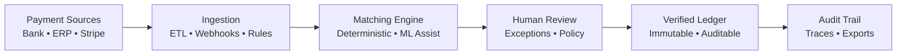
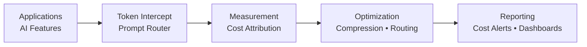
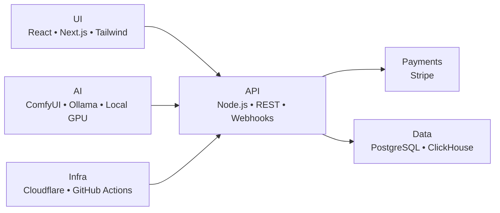

<!-- ========================================================= -->
<!-- HERO -->
<!-- ========================================================= -->

<h1 align="center">Scott Hardie</h1>

<h3 align="center">
Technical Product Manager • Solutions Architect • Platform Systems
</h3>

Solutions Architect @ <strong>McGraw Hill</strong> 
Canada • Platform Architecture • SaaS Systems • Automation Infrastructure

<a href="#platforms">Platforms</a> •
<a href="#products">Products</a> •
<a href="#repositories">Repositories</a> •
<a href="#proficiencies">Proficiencies</a>

---

## Platforms

Multi-tenant SaaS applications, deterministic AI execution pipelines, and operational automation tooling built for real production use.

**What I build:**
- SaaS applications with tenant isolation, billing integration, and audit trails
- AI workflow toolchains (ComfyUI) packaged as sellable digital products
- Reconciliation infrastructure (matching engines, ledger systems, drift detection)
- Webhook handling, API monitoring, and observability tooling
- Deployment automation via Cloudflare Workers/Pages/GitHub Actions

---

## Products

Sellable digital products — each is a self-contained ComfyUI workflow pack with commercial licensing and full documentation. Priced for solo creators and agencies.

| Product | Price | What You Get |
|---------|-------|--------------|
| [Node Starter Kit](https://github.com/Hardonian/ai-lab-command-center/tree/main/products/comfyui-node-starter-kit) | $39 lite / $99 commercial | Custom-node scaffold, example nodes, install guide, sales copy, license templates |
| [Fashion Lookbook Kit](https://github.com/Hardonian/ai-lab-command-center/tree/main/products/comfyui-fashion-lookbook-kit) | $69 creator / $149 agency | Editorial concept workflows, pose/upscale passes, look presets |
| [Product Photo Kit](https://github.com/Hardonian/ai-lab-command-center/tree/main/products/comfyui-product-photo-kit) | $59 niche / $129 studio | Clean product-shot prompts, upscale finishing, batch workflow |
| [Thumbnail Creator Kit](https://github.com/Hardonian/ai-lab-command-center/tree/main/products/comfyui-thumbnail-creator-kit) | $49 solo / $119 channel | Bold framing presets, multi-scene batch, brand-kit integration |

All products are **commercial-safe** (editorial/fictional use only), packaged with dual-license (lite + commercial), and ready for Gumroad publishing.

---

## Repositories

Active repositories grouped by domain. Repos range from deployed services to experimental scaffolds — each status is noted in the table.

### Payments & Financial Infrastructure

| Repo | What It Does | Status | Stack |
|------|-------------|--------|-------|
| [Settler](https://github.com/Hardonian/Settler) | Payment reconciliation API — deterministic matching, audit-trail ledger, human-review exceptions. API-first, designed for embedded use. | Active development (local) | TypeScript, Node.js, PostgreSQL, Prisma |

### AI Operations & Observability

| Repo | What It Does | Status | Stack |
|------|-------------|--------|-------|
| [TokenGoblin](https://github.com/Hardonian/TokenGoblin) | LLM token usage measurement, cost attribution per tenant/feature, prompt routing optimization. | Active development (local) | Go, React, TypeScript, ClickHouse |
| [ai-lab-command-center](https://github.com/Hardonian/ai-lab-command-center) | Local AI-lab dashboard — service health, audit logging, signal processing, product inventory. Frontend + API. | Running locally (:8000) | FastAPI, Python, Svelte |

### Webhook & API Tooling

| Repo | What It Does | Status | Stack |
|------|-------------|--------|-------|
| [webhook-witness](https://github.com/Hardonian/webhook-witness) | Capture, inspect, replay webhooks. API endpoints functional (Worker + D1 deployed). Billing shell only (Stripe not provisioned). | Phase 2 / Deployed | JavaScript, Cloudflare Workers, D1 |
| [api-changelog-radar](https://github.com/Hardonian/api-changelog-radar) | Planned changelog monitoring service. Currently a Cloudflare Workers scaffold with D1 schema design — no diffing, fetching, or alert dispatch implemented yet. | Scaffold / proof-of-concept | JavaScript, Cloudflare Workers, D1 |

### Infrastructure & DevOps

| Repo | What It Does | Status | Stack |
|------|-------------|--------|-------|
| [tfstate-drift-inspector](https://github.com/Hardonian/tfstate-drift-inspector) | Terraform state drift detection — CLI-based scan engine with Slack alerts and GitHub PR integration. Basic proof-of-concept. | Experimental / proof-of-concept | Python, Click, Docker, Fly.io |
| [cloudflare-app-ops-dashboard](https://github.com/Hardonian/cloudflare-app-ops-dashboard) | Portfolio dashboard with live status of all deployed Cloudflare services. | Cloudflare-deployed | TypeScript, Cloudflare Workers |
| [cloudflare-deploy-template](https://github.com/Hardonian/cloudflare-deploy-template) | Reusable one-shot deploy script: `./deploy-cloudflare-app.sh <name> <title> <tagline> <db-name> <db-id>` | Template (copy to deploy) | Shell, YAML, TOML |

### Developer Tools

| Repo | What It Does | Status | Stack |
|------|-------------|--------|-------|
| [Keys](https://github.com/Hardonian/Keys) | Backendless CLI for structured AI asset packs. No accounts, no servers. (Also: `JupyterNotebooks`, `floyo` — workflow automation and notebook tooling) | Active (local) | TypeScript, Node.js, Zod |

---

## Architecture Maps

### Settler — Reconciliation Pipeline

### TokenGoblin — Token Efficiency Pipeline

### Platform Stack

---

## Proficiencies

| Area | Notes |
|------|-------|
| Platform architecture | Multi-tenant SaaS, control planes, operator patterns |
| SaaS systems | RLS, tenant isolation, Stripe billing integration |
| Backend/API (Node.js, REST, Webhooks) | Idempotency, versioning, observability |
| Frontend (React, Next.js) | CWV optimization, accessibility, design systems |
| Data (PostgreSQL, Supabase, ClickHouse) | Partitioning, read replicas, RLS |
| AI workflow automation | Governance layers, deterministic execution, human gates |
| CI/CD (GitHub Actions, Cloudflare) | Verification matrices, reproducible deploys |
| Security (auth, tenant isolation) | OAuth2/OIDC, mTLS, capability-based auth |

---

## Technical Surface

**Primary:** TypeScript/JavaScript, Python, SQL, Go, HTML/CSS, Bash  
**Infrastructure:** Cloudflare Workers, PostgreSQL, Supabase, ClickHouse  
**AI:** ComfyUI, Ollama, Local GPU (V100/P40)  
**Systems knowledge:** Rust, C++, Zig

---

*For collaboration, open issues/discussions on [Settler](https://github.com/Hardonian/Settler) or [ai-lab-command-center](https://github.com/Hardonian/ai-lab-command-center).*