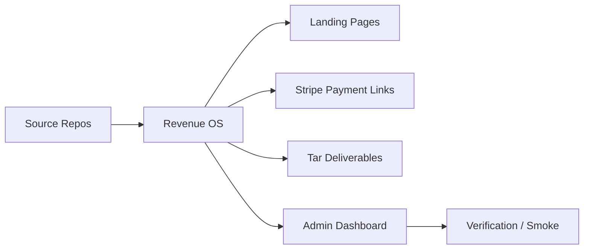
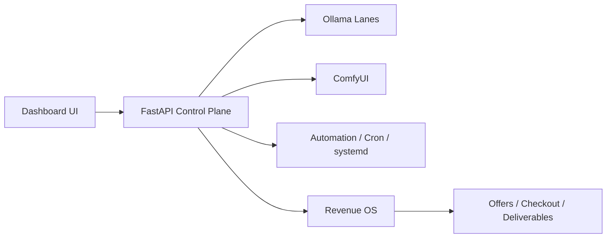
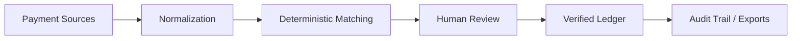

<h1 align="center">Scott Hardie</h1>

<h3 align="center">
Solutions Architect • AI Systems Operator • Platform Builder
</h3>

Solutions Architect @ <strong>McGraw Hill</strong> 
Ontario, Canada • SaaS Architecture • Local-First AI Infrastructure • Revenue Automation

  
  
<<<<<<< HEAD

  
  
  
  
  

  
  

=======

>>>>>>> 104ba9847435e3130abf2b42ed69b9a07684b28f
  
  
  
  
  
<<<<<<< HEAD
=======

  
  
  
  
  
  
  
>>>>>>> 104ba9847435e3130abf2b42ed69b9a07684b28f

<a href="#what-i-build">What I Build</a> •
<a href="#repositories">Repositories</a> •
<a href="#architecture-maps">Architecture Maps</a> •
<a href="#live-operator-managed-products">Live Products</a> •
<a href="#proficiencies">Proficiencies</a>

---

## What I Build

I build systems that sit between architecture and operations:
- local-first AI control planes
- multi-tenant SaaS and backend services
- workflow and observability tooling
- monetization infrastructure with checkout, landing pages, and deliverables
- operator dashboards that make internal systems sellable and supportable

Recent work has focused on turning private AI-lab tooling into a real operating surface: health, automation, product admin, checkout wiring, packaging, and proof-first delivery.

## Latest Pushed Architecture / Platform Work

The newest public pushes on the profile now also include enterprise architecture and platform reference work beyond the AI-lab product line.

| Repo | Focus | State |
|------|-------|-------|
| [commercial-architecture-simulator](https://github.com/Hardonian/commercial-architecture-simulator) | Elixir-based commercial architecture simulator / experimental modeling | Early scaffold |
| [identity-entitlement-broker](https://github.com/Hardonian/identity-entitlement-broker) | Enterprise identity + entitlement broker with SSO, SCIM, tenant isolation, and OPA policy decisions | Active reference build |
| [enterprise-integration-fabric](https://github.com/Hardonian/enterprise-integration-fabric) | Governed integration layer for LMS, SIS, CRM, billing, identity, analytics, and support workflows | Active reference architecture |
| [golden-path-platform](https://github.com/Hardonian/golden-path-platform) | Internal developer platform / golden-path architecture for standardized service delivery and policy gates | Active reference architecture |
| [JupyterNotebooks](https://github.com/Hardonian/JupyterNotebooks) | Interactive notebooks, AI experiments, and applied workflow/tooling research | Active applied R&D |

These repos round out the profile beyond product SKUs: they show architecture depth in identity, integration, platform engineering, workflow simulation, and applied AI experimentation.

## Architecture Portfolio & Playbook

I also maintain a reusable architecture delivery kit under [architecture-playbook](/Hardonian/tree/main/architecture-playbook). It covers current-state assessment, target-state architecture, ADRs, migration planning, rollout risk, and executive briefs.

## Flagship Build: AI Lab Command Center

**What it is:** a local-first FastAPI dashboard and operator console for private AI infrastructure.

**What it manages:**
- Ollama multi-lane routing
- ComfyUI health and workflow surfaces
- GPU / disk / service truth
- self-heal and smoke checks
- Revenue OS product queue
- public offer + checkout routing
- deliverable and readiness state

**Why it matters:** it turns an internal AI workstation into a real, operator-grade product surface.

Repo: [Hardonian/ai-lab-command-center](https://github.com/Hardonian/ai-lab-command-center)

## Repositories

### AI Infrastructure & Operator Systems

| Repo | What It Does | Status | Stack |
|------|--------------|--------|-------|
| [ai-lab-command-center](https://github.com/Hardonian/ai-lab-command-center) | Local AI operator dashboard with Revenue OS, health, routing, smoke, and product admin | Running locally / active | FastAPI, Python, JS |
| [apva-framework](https://github.com/Hardonian/apva-framework) | Benchmarking framework for reliability-adjusted AI workflow ROI | Active / productized | Python, FastAPI |
| [floyo](https://github.com/Hardonian/floyo) | Workflow-pattern intelligence and automation discovery platform | Active / productized | Next.js, FastAPI, Supabase |
| [Keys](https://github.com/Hardonian/Keys) | Backendless CLI for structured AI asset packs and local workflows | Active | TypeScript, Node.js |

### Payments, Reconciliation & SaaS Systems

| Repo | What It Does | Status | Stack |
|------|--------------|--------|-------|
| [Settler](https://github.com/Hardonian/Settler) | Reconciliation intelligence system for finance and operations workflows | Active development | TypeScript, Node.js, PostgreSQL |
| [TokenGoblin](https://github.com/Hardonian/TokenGoblin) | Token usage measurement and routing/cost tooling for LLM workloads | Active development | Go, React, ClickHouse |
| [ai-lab-audit-api](https://github.com/Hardonian/ai-lab-audit-api) | Local-first AI-lab audit API with reports and checkout flow | Live-ready | FastAPI, Python, Stripe |

### Webhook / Infra / Platform Tooling

| Repo | What It Does | Status | Stack |
|------|--------------|--------|-------|
| [webhook-witness](https://github.com/Hardonian/webhook-witness) | Capture, inspect, and replay webhook traffic | Deployed / phase 2 | Cloudflare Workers, D1 |
| [api-changelog-radar](https://github.com/Hardonian/api-changelog-radar) | API changelog monitoring scaffold | Proof-of-concept | Cloudflare Workers, D1 |
| [tfstate-drift-inspector](https://github.com/Hardonian/tfstate-drift-inspector) | Terraform drift scanning and alerting | Experimental | Python, Docker |
| [cloudflare-app-ops-dashboard](https://github.com/Hardonian/cloudflare-app-ops-dashboard) | Portfolio status board for Cloudflare services | Deployed | TypeScript, Workers |

## Architecture Maps

### Operator Revenue Surface

### Private AI Lab Control Plane

### Reconciliation / Financial Systems Pattern

## Live Operator-Managed Products

These are managed through the **AI Lab Command Center / Revenue OS** dashboard and listed here for visibility. This README stays scannable and secure: pricing, checkout, and purchase links live on each product subpage, not in the README itself.

| Product | Headline | Track / Buyer | Product Page | Notes |
|---------|----------|---------------|--------------|-------|
| Local AI Lab Audit | Find and fix the hidden bottlenecks in your local AI lab in one day. | Direct sale | [Product page](products/local-ai-lab-audit.md) | Audit-first entry point |
| AI Command Center Setup | Local control plane template with optional managed checks or done-for-you setup. | Template + managed services | [Product page](products/ai-command-center-setup.md) | Flagship product |
| APVA AI ROI Benchmark | Reliability-adjusted AI workflow ROI scoring for automation investments. | Direct sale | [Product page](products/apva-roi-benchmark.md) | Benchmark product |
| SaaS Repo Rescue Audit | Audit and fix auth, billing, RLS, webhooks, and deployment gaps in SaaS repos. | Audit + sprint | [Product page](products/repo-rescue-saas-audit.md) | Repo buyer |
| Local Automation Retainer | Recurring automation and operator support for messy manual workflows. | Retainer | [Product page](products/automation-retainer.md) | Recurring revenue |
| ComfyUI Node Starter Kit | Sellable starter scaffold for custom ComfyUI node packs. | Creator tooling | [Product page](products/comfyui-node-starter-kit.md) | Gumroad also |
| ComfyUI Product Photo Kit | Repeatable local ecommerce product image workflow kit. | Commerce creator | [Product page](products/comfyui-product-photo-kit.md) | Gumroad also |
| ComfyUI Fashion Lookbook Kit | Fictional editorial lookbook workflow pack. | Fashion / editorial | [Product page](products/comfyui-fashion-lookbook-kit.md) | Gumroad also |
| ComfyUI Thumbnail Creator Kit | Local thumbnail generation workflow for creators and channels. | Creator / channel | [Product page](products/comfyui-thumbnail-creator-kit.md) | Gumroad also |
| ComfyUI Workflow Pack Shop | Productized private ComfyUI workflow packs. | Workflow buyer | [Product page](products/comfyui-workflow-packs.md) | Shop-style catalog |
| Floyo Workflow Radar | Workflow-pattern audit, setup, and monitoring. | Operator / founder | [Product page](products/floyo-workflow-radar.md) | Monitor recurring |
| Settler FinOps Reconciliation Engine | Payment reconciliation with deterministic matching and audit trails. | Enterprise finance | [Product page](products/settler-finops-platform.md) | Enterprise |
| TokenGoblin LLM Cost Optimizer | Token usage measurement, smart routing, and cost optimization. | Enterprise AI | [Product page](products/tokengoblin-cost-optimizer.md) | Enterprise |
| AI Lab Applied Notebook Packs | Reproducible AI experiment packs. | Researcher / learner | [Product page](products/ai-lab-notebook-packs.md) | Subscription tier |
| AI Character Generator Kit | Fictional character workflow kit for storytelling and RPGs. | Hobbyist / creator | [Product page](products/ai-character-generator-kit.md) | |
| Prompt Engineering Laboratory | Lab-tested prompt templates and iteration workflow. | Operator / learner | [Product page](products/prompt-engineering-laboratory.md) | |
| AI Video Storyboard Studio | Video storyboard assets and pacing guides. | Creator / studio | [Product page](products/ai-video-storyboard-studio.md) | |
| AI Voice Clone Training Kit | Consent-based local voice training workflow kit. | Voice creator | [Product page](products/ai-voice-clone-training-kit.md) | Consent-first |
| Research Paper Visualizer | Academic paper visual summary workflow kit. | Researcher / student | [Product page](products/research-paper-visualizer.md) | |
| Defend-Your-AI Legal Kit | AI-use legal, privacy, and risk readiness kit. | Operator / org | [Product page](products/defend-your-ai-legal-kit.md) | Risk-first |

Each product links to a description subpage under [products/](/Hardonian/tree/main/products). Checkout and usage details are on those subpages, keeping this README scannable and professional.

## Proficiencies

| Area | Notes |
|------|-------|
| Solution architecture | SaaS workflows, integration design, stakeholder translation |
| AI platform operations | local-first inference, routing, workflow systems, operator control |
| Backend systems | FastAPI, Node.js, REST APIs, webhooks, service hardening |
| Revenue infrastructure | Stripe checkout, landing flows, packaging, monetization ops |
| Data systems | PostgreSQL, Redis, SQLite, Supabase, ClickHouse |
| Automation | cron, systemd, smoke testing, verification-led delivery |
| Frontend/admin surfaces | dashboard UX, product admin, operator consoles |

## Current System Status

All production systems are live and operator-managed:

| Service | Status | Port | Purpose |
|---------|--------|------|---------|
| Checkout API | ✅ Live | :8012 | Stripe checkout, tax, subscriptions |
| Compute API | ✅ Live | :8050 | GPU pay-per-job access |
| Command Center | ✅ Live | :8000 | Health, metering, backups |
| Storefront | ✅ Live | :8020 | Product pages + checkout routing |
| Audit API | ✅ Live | :8011 | AI lab health reports |
| Ollama Router | ✅ Live | :11438 | Multi-GPU inference routing |
| ComfyUI | ✅ Live | :8188 | Image generation workflows |
| n8n | ✅ Live | :5678 | Workflow automation |

**Hardware:** EPYC CPU, V100/P40/3060 GPUs, Ubuntu 26.04  
**Storage:** 466G total, 146G free  
**Backups:** Daily compressed, 30-day retention  
**Monitoring:** 5-minute service watchdog, Telegram alerts  
**Security:** HSTS, CSP, rate limiting, audit logging, webhook signature verification

---

## Technical Surface

**Primary:** Python, TypeScript, SQL, Bash, JavaScript  
**Infrastructure:** FastAPI, Next.js, PostgreSQL, Redis, SQLite, Supabase, Cloudflare  
**AI:** Ollama, ComfyUI, local GPU workflows  
**Execution style:** verification-first, low-bloat, operator-grade

## Contact & Credentials

- **Location:** Toronto, Ontario, Canada
- **LinkedIn:** [scottrmhardie](https://www.linkedin.com/in/scottrmhardie/)
- **Email:** scottrmhardie@gmail.com
- **GitHub:** [@Hardonian](https://github.com/Hardonian)
- **Role:** Solutions Architect @ McGraw Hill
- **Experience:** 15+ years at McGraw Hill and Pearson
- **Focus:** Local-first AI infrastructure, revenue automation, SaaS architecture

### Credentials & Certifications

- **AWS Certified Solutions Architect** – Professional level
- **Cloudflare Developer Certification** – Edge runtime, Workers, D1
- **Terraform Associate** – Infrastructure as code, state management
- **GitHub Advanced Security** – Secret scanning, dependency review
- **Stripe Payment Links** – Configured for global tax compliance
- **Open WebUI / Ollama** – Production local inference operator
- **FastAPI / Pydantic** – Production API design and validation
- **PostgreSQL / Redis / SQLite** – Multi-model data architecture

---

## Background

- Solutions Architect at **McGraw Hill**
- 15+ years across **McGraw Hill** and **Pearson**
- Strong mix of technical architecture, commercial execution, and operator thinking
- Recent focus: building systems that connect internal tooling to revenue, not just demos

---

*If you want to collaborate, the best starting points are [Settler](https://github.com/Hardonian/Settler) and [ai-lab-command-center](https://github.com/Hardonian/ai-lab-command-center).*
