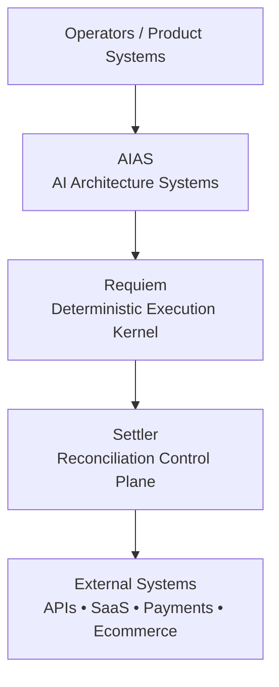
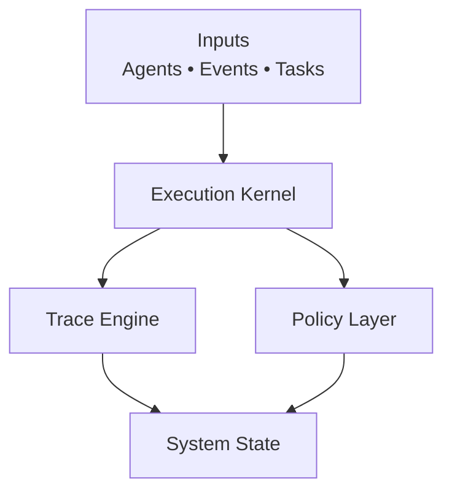
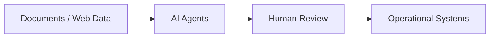
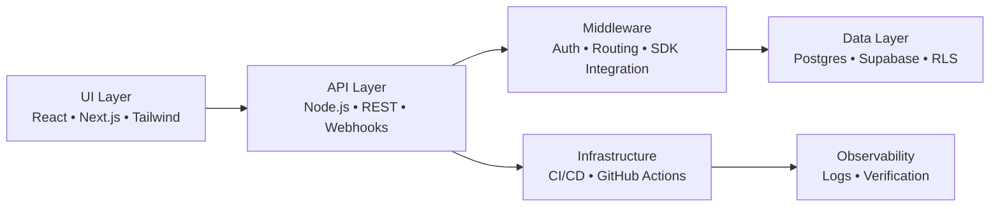

<!-- ========================================================= -->
<!-- HERO -->
<!-- ========================================================= -->

<h1 align="center">🚀 Scott Hardie</h1>

<h3 align="center">
Technical Product Manager • Solutions Architect • Platform & Automation Systems
</h3>

<em>Designing and shipping reliable systems where product thinking, architecture, and operations intersect.</em>

🏢 Solutions Architect @ <strong>McGraw Hill</strong> 
🇨🇦 Canada • EdTech • SaaS Platforms • Ecommerce Systems

---

# About

I’m **Scott Hardie**, a Solutions Architect at **McGraw Hill** working across:

- platform architecture  
- operational automation  
- applied AI systems  
- SaaS and ecommerce platforms  

My work sits at the intersection of:

**product direction → system architecture → shipped systems**

with emphasis on reliability, observability, and operational clarity.

Many systems I work on must function in **messy real-world environments**, not controlled demos.

---

# Core Platform Projects

## System Relationship Map

---

# Settler Architecture (Reconciliation Control Plane)

Purpose:

A control plane exploring how reconciliation workflows can move from **manual accounting tasks to deterministic automation systems with traceability**.

---

# Requiem Architecture (Deterministic Kernel)

Focus:

- deterministic execution
- system traceability
- agent orchestration
- governance and reproducibility

---

# AIAS Architecture (AI Workflow Layer)

Purpose:

AI workflows that remain **observable, governable, and operationally safe**.

---

# Platform Stack

Most systems span multiple layers of the stack.

---

# Technical Surface

## Languages

Primary working stack

- TypeScript / JavaScript
- SQL
- Python
- Bash

Systems familiarity

- Rust
- C++

Used selectively for systems-oriented experimentation.

---

# Capability Map

| Layer | Technologies |
|-----|-----|
| Frontend | React, Next.js, Tailwind |
| Backend | Node.js APIs, REST, Webhooks |
| Data | Postgres, Supabase, RLS |
| Integration | OAuth, SDKs, SaaS APIs |
| Automation | AI Agents, Workflow Systems |
| DevOps | GitHub Actions, CI/CD |
| Security | Auth layers, tenant isolation |
| Performance | Core Web Vitals, SEO |
| Accessibility | WCAG aware design |
| Growth | CRO-informed UX |

---

# Backend & Platform Systems

Typical backend architecture includes:

- Node.js API services  
- REST APIs  
- webhook pipelines  
- event-driven automation  
- service integrations  

Data architecture commonly includes:

- Postgres  
- Supabase  
- Row-Level Security  
- multi-tenant boundaries  
- migration discipline  

Focus areas include **traceability, reliability, and operational clarity**.

---

# Frontend & Product Surface

User-facing systems typically use:

- React  
- Next.js  
- Tailwind CSS  

Design priorities:

- truthful system states  
- degraded-state UX  
- accessibility-first thinking  
- performance-aware UI  
- component-driven architecture  

---

# APIs, Middleware & Integrations

Typical architecture includes:

- API route design  
- middleware layers  
- authentication boundaries  
- SDK integrations  
- third-party platform integrations  

Common integrations include:

- SaaS APIs  
- OAuth systems  
- webhook pipelines  
- ecommerce platforms  
- payment providers  

---

# Security & System Integrity

Operational systems require careful boundaries.

Typical concerns include:

- authentication and authorization  
- tenant isolation  
- webhook verification  
- secrets management  
- operational auditability  

The goal is systems that **fail safely and predictably**.

---

# Testing, CI & Delivery

Delivery workflows typically include:

- GitHub Actions  
- CI verification pipelines  
- regression testing  
- smoke tests  
- reproducible builds  
- safe deployment practices  

Operational reliability is treated as **part of product quality**.

---

# Performance, SEO & Product Optimization

Public-facing systems require attention to:

- SEO architecture  
- Core Web Vitals  
- crawler compatibility  
- accessibility (WCAG)

For SaaS and ecommerce platforms:

- CRO-informed UX  
- funnel friction reduction  
- performance-aware UI architecture  

---

# Additional Projects

- **Hardonia** — ecommerce automation experiments  
- **eCommerce Manager** — AI-assisted ecommerce operations  
- **AI-Agent-Portfolio** — applied AI workflows  
- **hardonia-intel-scraper** — research automation  

---

# Operating Principles

Design heuristics I return to frequently:

- reduce complexity before automating it  
- prefer observable systems over opaque abstractions  
- design for degraded states  
- keep humans in the loop where judgment matters  
- optimize for systems that survive real-world conditions  

If a system cannot be **explained, debugged, or recovered**, it probably is not ready to ship.

---

<em>
Reduce friction ✨  
Automate responsibly 🤖  
Keep humans in control 🧠
</em>

