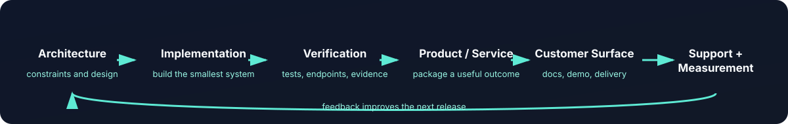

<h1 align="center">Scott Hardie</h1>

<strong>Solutions Architect · AI Systems Operator · Platform Builder</strong> 
I turn complex AI, SaaS, integration, and revenue workflows into systems people can operate.

  
  
  
  

Toronto, Canada · SaaS architecture · local-first AI · observability · automation · commercial systems

## What I build

- Local-first AI control planes, inference routing, and GPU workflows
- Reliable SaaS backends with auth, tenancy, billing, webhooks, and data integrity
- Integration and identity architectures for complex business systems
- Operator tooling that turns infrastructure into a repeatable service
- Proof-first productization: documentation, packaging, checkout, fulfillment, and support

## Platform status — live infrastructure

  
  
  
  
  

| Layer | Component | Status |
|---|---|---|
| Control plane | Command center, self-heal, watchdogs | 10/10 services, 83 cron jobs, 0 errors |
| GPU fleet | V100 16GB · P40 24GB · RTX 3060 12GB | 3 lanes, auto-routing, health-probed |
| Inference | 13 local models (hermes3, qwen3, deepseek-r1, glm-4, etc.) | Ollama router on port 11438 |
| Image workflows | ComfyUI + custom nodes + workflow packs | Proved, documented, packaged |
| Checkout | Stripe → checkout-api → revenue-os → fulfillment | Webhook-verified, receipt-signed |
| Revenue ledger | purchases, leads, truth classification, daily rollups | 161 verified purchases |
| Audit | Audit API, proof score, benchmark | Synthetic harness: 4/4 pass |
| Storefront | 20 product routes, legal pages, proof score | Public at aiautomatedsystems.ca |
| Compute | GPU job API, credit accounting, signed delivery | Authenticated, bounded, auditable |
| Monitoring | Disk watchdog, service health, self-heal | 6h disk budget, auto-restart |

## Technology stack — click a logo

  
  
  
  
  
  
  
  
  
  
  
  
  

## Start here

| If you want to… | Start with |
|---|---|
| See production-minded Python/API work | [llm-inference-api](https://github.com/Hardonian/llm-inference-api) · [ollama-router](https://github.com/Hardonian/ollama-router) |
| Explore AI workflow and image infrastructure | [comfyui-api](https://github.com/Hardonian/comfyui-api) · [Nautilus](https://github.com/Hardonian/Nautilus) |
| See finance, cost, and reconciliation systems | [Settler](https://github.com/Hardonian/Settler) · [TokenGoblin](https://github.com/Hardonian/TokenGoblin) |
| See enterprise architecture patterns | [identity-entitlement-broker](https://github.com/Hardonian/identity-entitlement-broker) · [enterprise-integration-fabric](https://github.com/Hardonian/enterprise-integration-fabric) · [golden-path-platform](https://github.com/Hardonian/golden-path-platform) |
| Browse applied research and experiments | [JupyterNotebooks](https://github.com/Hardonian/JupyterNotebooks) · [AI-Agent-Portfolio](https://github.com/Hardonian/AI-Agent-Portfolio) |
| See the customer-facing surface | [AI Automated Systems](https://www.aiautomatedsystems.ca) · [storefront](https://github.com/Hardonian/storefront) |
| Get an AI lab health report | [AI Lab Health Report](https://aiautomatedsystems.ca/p/ai-lab-health-report) |
| Run a private GPU job | [Compute API Access](https://aiautomatedsystems.ca/p/hardonia-compute-api-access) |

## The Platform

I operate a private, local-first AI lab and product platform. Its internal control plane, checkout API, audit API, compute lanes, and revenue database are intentionally private; the public profile links only to repositories and surfaces that visitors can actually open.

The operating loop is:

  

The design priorities are boring reliability, tenant and payment integrity, local privacy, observable operations, and small systems that reduce manual work.

### What runs on the platform

The platform is not a demo. It is a live, revenue-generating system that processes real Stripe payments, runs real GPU jobs, and publishes real operational evidence. Here is what is actually running:

**Inference fleet** — Three GPU lanes (V100, P40, RTX 3060) behind an Ollama router with automatic model selection, health probing, and fallback routing. 13 models loaded for chat, code, vision, and embedding workloads.

**Image workflows** — ComfyUI with custom nodes, documented workflows, and packaged workflow subscriptions. Batch generation, quality presets, and repeatable local pipelines.

**Checkout and fulfillment** — Stripe checkout → webhook verification → revenue-os ledger → automated fulfillment. Webhook signatures are validated. Receipts are signed. The ledger is the single source of truth.

**Revenue operations** — Purchase classification, truth verification, daily rollups, weekly snapshots, and leakage reports. Every number in the dashboard is traceable to a real Stripe event or classified as test/synthetic.

**Compute API** — Prepaid credit model for GPU job execution. API-key isolation, bounded execution, signed result delivery, and webhook callbacks. No metered billing in this release.

**Proof layer** — A synthetic benchmark harness that validates policy enforcement, hash-chain integrity, and denial behavior. Published as a public proof score backed by real operational evidence.

**Self-heal** — Automated service restart, disk budget monitoring, and cron job health checks. The platform monitors itself and escalates to the operator only when automated recovery is insufficient.

### Recovered enterprise lineage

The following repositories are active again because they form a coherent foundation for The Platform. They are reference implementations and capability surfaces, not claims that every route or deployment topology is production-ready.

- [Requiem](https://github.com/Hardonian/Requiem) — native execution engine, operator console lineage, and deterministic control-plane experiments
- [Reach](https://github.com/Hardonian/Reach) — deterministic run, transcript, replay, and cryptographic evidence contracts
- [ReadyLayer](https://github.com/Hardonian/ReadyLayer) — AI-assisted software delivery governance, policy checks, provenance, and evidence export
- [Zeo](https://github.com/Hardonian/Zeo) — local-first composable agent pipelines, signed module artifacts, and deterministic exports
- [truthcore](https://github.com/Hardonian/truthcore) — Python verification, content-addressed caching, anomaly detection, and offline evidence reports
- [JobForge](https://github.com/Hardonian/JobForge) — Postgres-native idempotent jobs, retries, backoff, and RLS-aware execution contracts
- [MissionLedger](https://github.com/Hardonian/MissionLedger) — governed agent missions, policy boundaries, and proof-grade execution records

The enterprise fold is intentionally modular:

- verification and evidence → `truthcore` + `Reach`
- governed execution and durable jobs → `Requiem` + `JobForge` + `MissionLedger`
- AI-assisted delivery assurance → `ReadyLayer` + `Zeo`
- local-first runtime and hardware-aware routing → existing The Platform control plane, Ollama lanes, and ComfyUI services

Additional archived prototypes remain preserved while their useful contracts are extracted into the private platform rather than presented as live products.

## Public work by area

### AI and platform engineering

- [llm-inference-api](https://github.com/Hardonian/llm-inference-api) — OpenAI-compatible local inference gateway patterns
- [ollama-router](https://github.com/Hardonian/ollama-router) — multi-lane local model routing
- [Nautilus](https://github.com/Hardonian/Nautilus) — deterministic operational AI infrastructure concepts
- [comfyui-api](https://github.com/Hardonian/comfyui-api) — Cloudflare-facing ComfyUI integration work
- [ControlPlane](https://github.com/Hardonian/ControlPlane) — control-plane exploration and operator architecture

### Finance, cost, and reliability

- [Settler](https://github.com/Hardonian/Settler) — reconciliation intelligence for finance and operations
- [TokenGoblin](https://github.com/Hardonian/TokenGoblin) — AI spend and token-efficiency observability
- [finops-autopilot](https://github.com/Hardonian/finops-autopilot) — FinOps automation concepts
- [reliability-platform](https://github.com/Hardonian/reliability-platform) — reliability-oriented platform work
- [webhook-witness](https://github.com/Hardonian/webhook-witness) — webhook capture and inspection patterns

### Enterprise architecture

- [identity-entitlement-broker](https://github.com/Hardonian/identity-entitlement-broker) — identity, entitlements, and policy boundaries
- [enterprise-integration-fabric](https://github.com/Hardonian/enterprise-integration-fabric) — governed integration architecture
- [golden-path-platform](https://github.com/Hardonian/golden-path-platform) — developer-platform and delivery guardrails
- [commercial-architecture-simulator](https://github.com/Hardonian/commercial-architecture-simulator) — experimental commercial modeling
- [architecture-playbook](architecture-playbook/README.md) — reusable architecture delivery notes

## Productized workflow packs

These public pages describe real artifacts in this repository. Availability, pricing, and fulfillment state are kept on the product page rather than overstated in the profile.

| Pack | Use |
|---|---|
| [AI Command Center Setup](products/ai-command-center-setup.md) | Local operator-control-plane setup |
| [APVA AI ROI Benchmark](products/apva-roi-benchmark.md) | Reliability-adjusted workflow ROI analysis |
| [SaaS Repo Rescue Audit](products/repo-rescue-saas-audit.md) | Auth, billing, RLS, webhook, and deployment review |
| [Automation Retainer](products/automation-retainer.md) | Recurring workflow and operator support |
| [ComfyUI Workflow Packs](products/comfyui-workflow-packs.md) | Private local image-workflow assets |
| [Settler FinOps Engine](products/settler-finops-platform.md) | Reconciliation and audit-trail patterns |
| [TokenGoblin Cost Optimizer](products/tokengoblin-cost-optimizer.md) | LLM usage and routing cost controls |
| [Consent-based Voice Training Kit](products/ai-voice-clone-training-kit.md) | Adult, consensual, rights-aware voice workflows |

## How I work

1. Discover the actual system and constraints.
2. Fix the smallest root cause.
3. Keep private infrastructure private.
4. Verify with real tests, endpoints, assets, and logs.
5. Separate technical readiness from commercial proof.
6. Document rollback and the next highest-leverage action.

## Contact

- [LinkedIn](https://www.linkedin.com/in/scottrmhardie/)
- [AI Automated Systems](https://www.aiautomatedsystems.ca)
- [GitHub profile](https://github.com/Hardonian)
- [Email Scott](mailto:scottrmhardie@gmail.com)

> If you are building a serious AI, SaaS, integration, or operations system, start with a specific problem, a measurable outcome, and a verifiable path to production.
