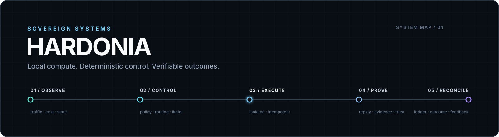

# HARDONIA

### Local compute. Deterministic control. Verifiable outcomes.

**Scott Hardie** · Solutions Architect · AI Systems Builder · Toronto, Canada

[Explore the systems](#selected-systems) · [Read the architecture](#the-platform) · [View the storefront](https://www.aiautomatedsystems.ca) · [Connect](https://www.linkedin.com/in/scottrmhardie/)

 

`LOCAL-FIRST AI` · `CONTROL PLANES` · `DETERMINISTIC BACKENDS` · `FINOPS` · `VERIFICATION`

---

## Built for the moment after the demo

AI demos are easy. Production systems must survive retries, partial failure, hostile inputs, runaway spend, model drift, and an auditor asking exactly what happened.

Hardonia is a working portfolio of control planes, runtimes, security boundaries, and commercial systems designed around one idea:

> **Intelligence can be probabilistic. Infrastructure cannot.**

**Best-fit work:** production AI and platform architecture, technical due diligence, and modernization of systems where security, reliability, or financial correctness matters. I take on selective independent engagements alongside my full-time role.

| **Observe** | **Control** | **Prove** |
| :--- | :--- | :--- |
| Capture agent, model, tool, cost, and transaction events. | Route workloads, enforce policy, isolate tenants, and recover safely. | Replay decisions, verify state, reconcile money, and export evidence. |

  <a href="#selected-systems"><kbd>Selected systems</kbd></a>&nbsp;&nbsp;
  <a href="#the-platform"><kbd>Platform</kbd></a>&nbsp;&nbsp;
  <a href="#selected-evidence"><kbd>Evidence</kbd></a>&nbsp;&nbsp;
  <a href="#engineering-vault"><kbd>All projects</kbd></a>&nbsp;&nbsp;
  <a href="#productized-systems"><kbd>Products</kbd></a>&nbsp;&nbsp;
  <a href="#lets-build"><kbd>Contact</kbd></a>

---

## The platform

The system map above is the visual overview. This table defines the responsibility and evidence boundary at each layer without pretending a static README is a live operations console.

| Layer | Responsibility | Representative systems | Evidence boundary |
| --- | --- | --- | --- |
| **Observe** | Capture protocol traffic, latency, cost, model usage, and business events. | AgentPCAP · TokenGoblin | Raw events and reproducible captures; no inferred health claims. |
| **Control** | Apply identity, policy, routing, resource, and tenant constraints before execution. | mcpwall · AgentMesh · ModelForge | Versioned policy and explicit inputs; denied actions remain denied. |
| **Execute** | Run bounded work with idempotency, isolation, retries, and controlled fallback. | JobForge · Reach · local inference | Execution records describe what ran, not what was intended. |
| **Prove** | Preserve transcripts, provenance, hashes, and replayable evidence. | truthcore · veridag · ReadyLayer | Claims link to inspectable artifacts or remain qualified. |
| **Reconcile** | Compare technical and financial records against authoritative sources. | Settler · webhook-witness | Provider-correlated settlement is distinct from catalog, checkout, or local state. |

 checks the profile structure, generated project metadata, evidence freshness, product pages, local assets, and public links.

---

## Selected systems

These four projects form a complete operating chain and receive the primary attention on this profile. Maturity is deliberately conservative: `stable` means a versioned release exists; `beta` means the public system is functional but interfaces may change; `research` means the architecture is being actively validated.

<!-- profile-projects:start -->
_Public project metadata last verified **2026-09-19** · [source manifest](profile-projects.json) · [verification policy](CONTRIBUTING.md#project-metadata)_

| Project | Problem | Public evidence |
| --- | --- | --- |
| **[AgentPCAP](https://github.com/Hardonian/AgentPCAP)** · Go Observe · `beta`  | Agent failures cross model, tool, MCP, and A2A boundaries that ordinary application logs do not join. | Open .apcap schema, canonical protocol and failure-mode vectors, plus documented CI quality gates. [Architecture](https://github.com/Hardonian/AgentPCAP/blob/main/docs/ARCHITECTURE.md) · [Evidence](https://github.com/Hardonian/AgentPCAP/blob/main/spec/vectors/README.md) |
| **[mcpwall](https://github.com/Hardonian/mcpwall)** · Rust Control · `stable`  | Tool-capable models need a small, inspectable security boundary before requests reach local MCP servers. | Versioned v1.0.5 release, public firewall tests, release checksums, and a dedicated security workflow. [Architecture](https://github.com/Hardonian/mcpwall/blob/main/SECURITY.md) · [Evidence](https://github.com/Hardonian/mcpwall/releases/tag/v1.0.5) |
| **[ModelForge](https://github.com/Hardonian/ModelForge)** · TypeScript Compile · `research`  | Model deployment choices are usually made through trial, OOM failures, and untraceable sizing assumptions. | Revision-specific compute passports distinguish measured, documented, derived, and predicted evidence; performance CI is public. [Architecture](https://github.com/Hardonian/ModelForge/blob/main/docs/ARCHITECTURE.md) · [Evidence](https://github.com/Hardonian/ModelForge/tree/main/packages/benchmark-schema) |
| **[Settler](https://github.com/Hardonian/Settler)** · TypeScript Reconcile · `beta`  | Payment, banking, and operational records diverge unless matching and evidence rules are explicit. | Public reconciliation benchmark source and checked-in snapshots, with CI and security-invariant workflows. [Architecture](https://github.com/Hardonian/Settler/blob/main/docs/ARCHITECTURE.md) · [Evidence](https://github.com/Hardonian/Settler/blob/main/benchmarks/reconciliationBenchmark.ts) |
<!-- profile-projects:end -->

---

## Selected evidence

| Artifact | What it demonstrates | Inspect |
| --- | --- | --- |
| **AgentPCAP format and vectors** | A documented capture container with canonical MCP, A2A, OTLP, retry, incomplete, and error cases. | [Format specification](https://github.com/Hardonian/AgentPCAP/blob/main/spec/README.md) · [Test vectors](https://github.com/Hardonian/AgentPCAP/tree/main/spec/vectors) |
| **mcpwall release and tests** | A versioned security boundary with public firewall tests, checksums, and documented limitations. | [v1.0.5 release](https://github.com/Hardonian/mcpwall/releases/tag/v1.0.5) · [Firewall tests](https://github.com/Hardonian/mcpwall/blob/main/tests/firewall_tests.rs) |
| **ModelForge evidence model** | Deployment recommendations identify whether inputs are measured, documented, derived, or predicted. | [Benchmark schema](https://github.com/Hardonian/ModelForge/tree/main/packages/benchmark-schema) · [Performance CI](https://github.com/Hardonian/ModelForge/actions/workflows/modelforge-performance.yml) |
| **Settler reconciliation benchmarks** | Matching performance is represented by executable benchmark source and checked-in result snapshots. | [Benchmark source](https://github.com/Hardonian/Settler/blob/main/benchmarks/reconciliationBenchmark.ts) · [Snapshots](https://github.com/Hardonian/Settler/blob/main/benchmarks/snapshots.json) |
| **Profile integrity** | The portfolio itself is checked for metadata drift, stale verification, missing assets, malformed product pages, and dead links. | [Workflow](https://github.com/Hardonian/Hardonian/actions/workflows/profile-ci.yml) · [Verification script](scripts/profile-metadata.py) |

---

## Engineering vault

The portfolio covers AI infrastructure, enterprise reliability, financial systems, simulation, commerce, and applied tooling. The short list above is curated; the complete map lives here.

<strong>AI systems, agent control planes, and inference runtimes</strong>

- **[AgentPCAP](https://github.com/Hardonian/AgentPCAP)** `[Go · CLI]` — Protocol capture and deterministic replay for AI agents.
- **[AgentMesh](https://github.com/Hardonian/AgentMesh)** `[Go · Distributed]` — Identity, policy, routing, reliability, and progressive delivery for A2A and MCP.
- **[ModelForge](https://github.com/Hardonian/ModelForge)** `[TypeScript · Compute]` — Constraint-driven model deployment planning.
- **[mcpwall](https://github.com/Hardonian/mcpwall)** `[Rust · Security]` — Local-first MCP firewall and audit proxy.
- **[veridag](https://github.com/Hardonian/veridag)** `[Rust · Quint]` — Formally specified distributed trust DAG.
- **[nlsqlc](https://github.com/Hardonian/nlsqlc)** `[Rust · Compiler]` — Multi-tenant natural-language Query IR compiler.
- **[SawyerCore](https://github.com/Hardonian/SawyerCore)** `[Node · Python]` — Deterministic edge-AI runtime and simulation engine.
- **[llm-inference-api](https://github.com/Hardonian/llm-inference-api)** `[FastAPI]` — OpenAI-compatible local inference gateway.
- **[ollama-router](https://github.com/Hardonian/ollama-router)** `[Python · Daemon]` — Multi-lane model routing, health checks, and fallback.
- **[comfyui-api](https://github.com/Hardonian/comfyui-api)** `[Cloudflare · TypeScript]` — Headless ComfyUI automation and queue management.
- **[Nautilus](https://github.com/Hardonian/Nautilus)** `[Docker · Infrastructure]` — Containerized operational AI infrastructure.
- **[Keys](https://github.com/Hardonian/Keys)** `[TypeScript]` — Auditable mission control for constrained agents.
- **[ControlPlane](https://github.com/Hardonian/ControlPlane)** `[Python · Systems]` — Service supervision and operator architecture.
- **[AI-Agent-Portfolio](https://github.com/Hardonian/AI-Agent-Portfolio)** `[Python · Agents]` — Agent patterns, tool boundaries, and evaluations.
- **[JupyterNotebooks](https://github.com/Hardonian/JupyterNotebooks)** `[Jupyter · PyTorch]` — Quantization, vision, and fine-tuning research.

<strong>Governance, verification, and resilience</strong>

- **[continuityos](https://github.com/Hardonian/continuityos)** `[Go · OPA]` — Sovereign Resilience-as-Code.
- **[FlexibleAccessible](https://github.com/Hardonian/FlexibleAccessible)** `[TypeScript · SaaS]` — Continuous accessibility discovery and remediation operations.
- **[ReadyLayer](https://github.com/Hardonian/ReadyLayer)** `[TypeScript · CI]` — Delivery governance, provenance, and evidence export.
- **[truthcore](https://github.com/Hardonian/truthcore)** `[Python · Verification]` — Verification kernel, content-addressed cache, and evidence reports.
- **[Reach](https://github.com/Hardonian/Reach)** `[Rust · Runtime]` — Deterministic execution and transcript replay.
- **[Requiem](https://github.com/Hardonian/Requiem)** `[C++ · Native]` — Native execution and operator-console contracts.
- **[JobForge](https://github.com/Hardonian/JobForge)** `[PostgreSQL · TypeScript]` — Idempotent, RLS-isolated job execution.
- **[MissionLedger](https://github.com/Hardonian/MissionLedger)** `[TypeScript · Policy]` — Governed missions, budgets, and proofpacks.
- **[hardonia-compliance-agent](https://github.com/Hardonian/hardonia-compliance-agent)** `[Rust · Workspace]` — Autonomous regulatory-compliance tooling.
- **[hardonia-audit-pack](https://github.com/Hardonian/hardonia-audit-pack)** `[Python · Evidence]` — Deterministic reconciliation evidence bundles.

<strong>FinOps, ledger infrastructure, and commercial engines</strong>

- **[Settler](https://github.com/Hardonian/Settler)** `[TypeScript · TigerBeetle]` — Reconciliation intelligence and audit OS.
- **[WhatsForDinner](https://github.com/Hardonian/WhatsForDinner)** `[React · Stripe]` — Consumer AI SaaS with subscriptions, credits, marketplace, and vision workflows.
- **[TokenGoblin](https://github.com/Hardonian/TokenGoblin)** `[Go · ClickHouse]` — AI token-spend observability and routing guardrails.
- **[apva-framework](https://github.com/Hardonian/apva-framework)** `[Python · Telemetry]` — Reliability-adjusted AI ROI measurement.
- **[finops-autopilot](https://github.com/Hardonian/finops-autopilot)** `[Python · FinOps]` — Cost anomaly detection and rightsizing policies.
- **[webhook-witness](https://github.com/Hardonian/webhook-witness)** `[Rust · Cryptography]` — Signed, tamper-evident webhook ingestion and replay.
- **[commercial-architecture-simulator](https://github.com/Hardonian/commercial-architecture-simulator)** `[Python · Monte Carlo]` — SaaS pricing, churn, and unit-economics simulation.
- **[prompt-ops-hardonia-packs](https://github.com/Hardonian/prompt-ops-hardonia-packs)** `[Prompt Ops]` — Operator packs for GTM, outreach, and verification.
- **[TokPulse](https://github.com/Hardonian/TokPulse)** `[Turborepo · Remix]` — Multi-store creator-commerce operating system.
- **[storefront](https://github.com/Hardonian/storefront)** `[HTML · Edge]` — Edge-rendered commerce and digital fulfillment.

<strong>Simulation, game runtimes, platforms, and micro-tools</strong>

- **[CEO-G Canada Opportunity Graph](https://github.com/Hardonian/CEO-G-Canada-Economic-Opportunity-Graph)** `[Python · Graph]` — Sovereign infrastructure opportunity modeling.
- **[World26](https://github.com/Hardonian/World26)** `[Python · Simulation]` — Open planetary-systems simulator.
- **[WorldVM](https://github.com/Hardonian/WorldVM)** `[Rust · WASM]` — Sandboxed creator-built gameplay for major game engines.
- **[ReachRadar](https://github.com/Hardonian/ReachRadar)** `[Next.js · Analytics]` — Recommendation-algorithm observability.
- **[Zeo](https://github.com/Hardonian/Zeo)** `[TypeScript · Edge]` — Local-first, signed, composable agent pipelines.
- **[AI Automated Systems](https://github.com/Hardonian/AI-Automated-Systems_AIAS)** `[Astro · Static]` — Automation consulting and diagnostic surface.
- **[enterprise-integration-fabric](https://github.com/Hardonian/enterprise-integration-fabric)** `[Kotlin · Spring]` — Governed event-driven integration architecture.
- **[identity-entitlement-broker](https://github.com/Hardonian/identity-entitlement-broker)** `[Go · Zero Trust]` — Identity brokering and fine-grained entitlements.
- **[api-changelog-radar](https://github.com/Hardonian/api-changelog-radar)** `[Cloudflare Worker]` — Breaking-change detection for vendor APIs.
- **[reliability-platform](https://github.com/Hardonian/reliability-platform)** `[Go]` — Circuit breakers and automated disaster recovery.
- **[golden-path-platform](https://github.com/Hardonian/golden-path-platform)** `[Terraform · CI/CD]` — Compliant internal developer-platform templates.
- **[support-autopilot](https://github.com/Hardonian/support-autopilot)** `[Node.js · CLI]` — Autonomous support triage and diagnosis.
- **[ops-autopilot](https://github.com/Hardonian/ops-autopilot)** `[Python]` — Telemetry-driven reliability proposals through JobForge.
- **[growth-autopilot](https://github.com/Hardonian/growth-autopilot)** `[Python]` — SEO experiment and content proposals through JobForge.
- **[InboxExorcist](https://github.com/Hardonian/InboxExorcist)** `[Python · Gmail]` — Reversible inbox decluttering and filter automation.
- **[floyo](https://github.com/Hardonian/floyo)** `[Rust · Telemetry]` — Local workflow-opportunity detection.
- **[tfstate-drift-inspector](https://github.com/Hardonian/tfstate-drift-inspector)** `[Go · Terraform]` — Infrastructure drift inspection before apply.
- **[Architecture Playbook](architecture-playbook/README.md)** `[Documentation]` — Public patterns, controls, and evidence boundaries.

---

## Productized systems

The same architecture patterns are packaged as deployable kits, audits, and operator workflows.

| Product | Outcome | Explore |
| --- | --- | :---: |
| **AI Command Center** | Replace operational blind spots with health history, priorities, and revenue-aware triage. | [Open](products/ai-command-center-setup.md) |
| **SaaS Repo Rescue** | Audit auth, billing, webhooks, RLS, security boundaries, and revenue-leaking edge cases. | [Open](products/repo-rescue-saas-audit.md) |
| **Settler FinOps Engine** | Normalize and reconcile payment streams into deterministic evidence packs. | [Open](products/settler-finops-platform.md) |
| **TokenGoblin Optimizer** | Measure, route, budget, and reduce model inference spend. | [Open](products/tokengoblin-cost-optimizer.md) |
| **APVA ROI Benchmark** | Calculate reliability-adjusted value before scaling an AI workflow. | [Open](products/apva-roi-benchmark.md) |
| **Local AI Lab Audit** | Review GPU utilization, routing, model fit, security, and operating posture. | [Open](products/local-ai-lab-audit.md) |
| **ComfyUI Pro Workflows** | Run repeatable, private image-production pipelines on owned compute. | [Open](products/comfyui-workflow-packs.md) |
| **Automation Retainer** | Add senior architecture and workflow improvement without a full-time hire. | [Open](products/automation-retainer.md) |

<strong>Explore the complete 28-product catalog</strong>

### Creative and generative production

- [8K upscaling and facial restoration](products/advanced-upscale-restoration.md)
- [Architectural and interior visualization](products/architectural-interior-design.md)
- [E-commerce product relighting](products/ecommerce-product-relighting.md)
- [Flux inpainting and outpainting](products/flux-inpaint-outpaint-pro.md)
- [Flux portrait studio](products/flux-ultra-portrait-studio.md)
- [Game asset and PBR texture generation](products/game-asset-3d-generator.md)
- [Cinematic AI video production](products/video-production-cinema.md)
- [Voice-to-avatar lip sync](products/voice-to-avatar-lip-sync.md)
- [AI character generator](products/ai-character-generator-kit.md)
- [AI video storyboard studio](products/ai-video-storyboard-studio.md)
- [Consent-based voice cloning](products/ai-voice-clone-training-kit.md)
- [ComfyUI fashion lookbooks](products/comfyui-fashion-lookbook-kit.md)
- [ComfyUI product photography](products/comfyui-product-photo-kit.md)
- [ComfyUI thumbnail creation](products/comfyui-thumbnail-creator-kit.md)
- [ComfyUI custom-node starter](products/comfyui-node-starter-kit.md)

### Operations, research, and governance

- [Prompt engineering laboratory](products/prompt-engineering-laboratory.md)
- [Defend Your AI legal kit](products/defend-your-ai-legal-kit.md)
- [Floyo workflow radar](products/floyo-workflow-radar.md)
- [Research paper visualizer](products/research-paper-visualizer.md)
- [AI lab notebook packs](products/ai-lab-notebook-packs.md)

---

## Operating principles

| Principle | Working rule |
| --- | --- |
| **Evidence over confidence** | If a run cannot be inspected or replayed, it is not production-ready. |
| **Local-first by design** | Own the compute, data boundary, fallback path, and cost model wherever practical. |
| **Determinism at the edges** | Keep probabilistic intelligence inside explicit policy, schema, and execution constraints. |
| **Boring reliability wins** | Idempotency, RLS, state machines, and observable queues beat clever hidden behavior. |
| **Revenue is a reconciled event** | A dashboard row is not money; provider-correlated settlement evidence is money. |
| **Fix the smallest root cause** | Isolate the failure, repair it surgically, prove the result, then ship. |

---

## Working stack

---

## Frontier AI work

Alongside full-time solutions architecture work at **McGraw Hill**, I contribute independent, part-time expertise to confidential frontier-AI evaluation and systems initiatives.

The work spans complex technical reasoning, multi-step real-world evaluation design, failure-mode analysis, agent protocol governance, tool-execution boundaries, and structured feedback for enterprise-grade model behavior. Client, model, dataset, and internal research details remain confidential.

---

## Let's build

If you are working on a serious AI, SaaS, integration, reliability, or revenue system, start with a specific bottleneck, a measurable outcome, and a verifiable path to production.

 

© Scott Hardie · Hardonia Sovereign Systems · Toronto, Canada

