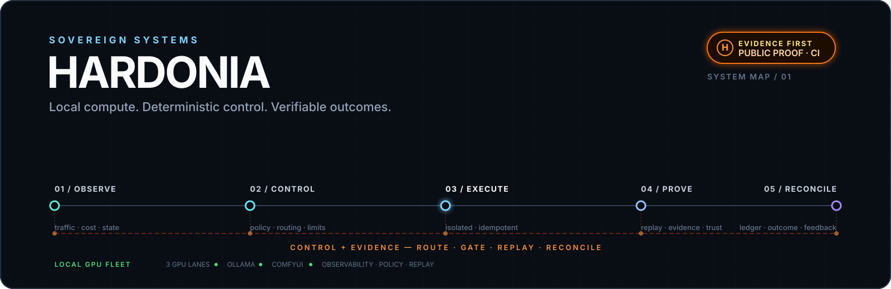
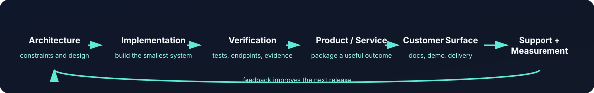

<div align="center">



# Scott Hardie

### Enterprise Applied AI Architect · AI Agents · Enterprise Integrations · Production AI Systems

> **Building production-grade agent infrastructure, enterprise AI integrations, and trustworthy multi-tenant AI systems.**

[Flagship Systems](#proof-backed-systems) · [Technical Writing](#technical-writing--architecture-guides) · [LinkedIn](https://www.linkedin.com/in/scottrmhardie/) · [Email](mailto:scottrmhardie@gmail.com)

`ENTERPRISE AI ARCHITECTURE` · `MODEL CONTEXT PROTOCOL (MCP)` · `POSTGRESQL RLS` · `AGENT EVALS` · `FINOPS`

</div>

---

## Built for the moment after the demo

AI demos are easy. Production systems must survive retries, partial failure, hostile inputs, runaway spend, model drift, and an auditor asking exactly what happened.

I design and build the infrastructure around the model: observable workflows, explicit policy boundaries, controlled execution, replayable evidence, and reconciled outcomes.

> **Intelligence can be probabilistic. Infrastructure cannot.**

| Observe | Control | Prove |
| --- | --- | --- |
| Capture model, tool, cost, and transaction events. | Route workloads, enforce policy, isolate risk, and recover safely. | Replay decisions, verify state, reconcile money, and export evidence. |

### Choose the shortest path

| If you are… | Start here | What you get |
| --- | --- | --- |
| An operations or engineering leader with a brittle AI workflow | **[Book a free 30-minute diagnostic](https://calendly.com/scottrmhardie)** | A constraint map, quick-win assessment, and candid next step. |
| Evaluating private or local AI | **[Run the free AI lab audit](https://www.aiautomatedsystems.ca/audit)** | A fast readiness signal before spending on infrastructure. |
| Reviewing the engineering | **[Inspect the public evidence](#proof-backed-systems)** | Architecture, tests, workflows, and conservative maturity labels. |

---

## Proof-backed systems

These are the four clearest public examples of the approach. The table is generated from a [versioned manifest](profile-projects.json), checked against GitHub every week, and deliberately separates released, beta, and research work.

<!-- profile-projects:start -->
_Public project metadata last verified **2026-10-01** · [source manifest](profile-projects.json) · [verification policy](CONTRIBUTING.md#project-metadata)_

| Project | Problem | Public evidence |
| --- | --- | --- |
| **[TokenGoblin](https://github.com/Hardonian/TokenGoblin)** · Go<br />Measure · `beta`<br />[](https://github.com/Hardonian/TokenGoblin/actions/workflows/ci.yml) | LLM workloads need cost, usage, and routing data before teams can control inference spend. | Public ingestion benchmarks, cost and routing tests, and a repository-level CI workflow.<br />[Architecture](https://github.com/Hardonian/TokenGoblin/blob/main/docs/ARCHITECTURE_AND_SPEC.md) · [Evidence](https://github.com/Hardonian/TokenGoblin/blob/main/internal/ingestion/benchmark_test.go) |
| **[ReadyLayer](https://github.com/Hardonian/ReadyLayer)** · TypeScript<br />Govern · `beta`<br />[](https://github.com/Hardonian/ReadyLayer/actions/workflows/security-gates.yml) | AI-assisted delivery needs policy, review, and evidence before generated changes reach production. | Public policy contracts, evidence export documentation, test suites, and CI quality gates.<br />[Architecture](https://github.com/Hardonian/ReadyLayer/blob/main/docs/runner/ARCHITECTURE.md) · [Evidence](https://github.com/Hardonian/ReadyLayer/blob/main/docs/EVIDENCE.md) |
| **[veridag](https://github.com/Hardonian/veridag)** · Rust<br />Prove · `research`<br />[](https://github.com/Hardonian/veridag/actions/workflows/formal.yml) | Distributed execution needs explicit ordering, capability security, and cross-language conformance. | A public protocol specification, Quint formal models, test vectors, and dedicated conformance workflows.<br />[Architecture](https://github.com/Hardonian/veridag/blob/main/docs/architecture.md) · [Evidence](https://github.com/Hardonian/veridag/blob/main/formal/README.md) |
| **[Settler](https://github.com/Hardonian/Settler)** · TypeScript<br />Reconcile · `beta`<br />[](https://github.com/Hardonian/Settler/actions/workflows/security.yml) | Payment, banking, and operational records diverge unless matching and evidence rules are explicit. | Public reconciliation benchmark source and checked-in snapshots, with CI and security-invariant workflows.<br />[Architecture](https://github.com/Hardonian/Settler/blob/main/docs/ARCHITECTURE.md) · [Evidence](https://github.com/Hardonian/Settler/blob/main/benchmarks/reconciliationBenchmark.ts) |
<!-- profile-projects:end -->

<div align="center">

[](https://github.com/Hardonian/Hardonian/actions/workflows/profile-ci.yml)

</div>

---

## Technical Writing & Architecture Guides

Field-tested engineering guides grounded in verified production code and open-source infrastructure:

1. **[Building Safe Multi-Tenant AI Agents with Postgres RLS](OPENAI_CAMPAIGN/content/01_safe_multi_tenant_ai_agents_postgres_rls.md)**  
   *Why application-level filtering fails in agentic workflows, and how to enforce mathematical tenant boundaries via PostgreSQL Row-Level Security with automated negative penetration tests.*
2. **[Enterprise Tool Calling: Why Authorization Belongs Outside the Model](OPENAI_CAMPAIGN/content/02_enterprise_tool_calling_authorization_outside_model.md)**  
   *Treating the LLM as an unprivileged planner; implementing policy-gated MCP reverse proxies with single-use cryptographic approval tokens for privileged side effects.*
3. **[From Prototype to Production: Architecture for Enterprise AI Agents](OPENAI_CAMPAIGN/content/03_from_prototype_to_production_enterprise_agents.md)**  
   *The six production pillars: model abstraction, tool execution boundaries, continuous CI/CD evaluations, OpenTelemetry observability, and token spend governance.*

---

## How I help

| Engagement | Best when | Outcome |
| --- | --- | --- |
| **AI clarity audit** | The opportunity is real, but the workflow and risk boundaries are not yet clear. | A decision-ready map of constraints, ownership, ROI assumptions, and the smallest safe pilot. |
| **Stabilization sprint** | An AI workflow is live but flaky, opaque, or expensive. | Explicit contracts, retries, telemetry, fallbacks, acceptance tests, and an operator runbook. |
| **Governance architecture** | Agents or models can take consequential actions. | Approval boundaries, policy gates, audit trails, incident paths, and evidence you can inspect. |
| **Local AI systems** | Data control, predictable cost, or offline capability matters. | Model and hardware fit, routing, deployment, observability, and a practical operating plan. |

Every engagement starts with the workflow—not a predetermined model or platform. See the [service details](https://www.aiautomatedsystems.ca/services), [case studies](https://www.aiautomatedsystems.ca/case-studies), or [book a diagnostic](https://calendly.com/scottrmhardie).

---

## How the platform fits together



Seven monorepos keep related systems coherent while preserving clear boundaries:

| Boundary | Public monorepos | Responsibility |
| --- | --- | --- |
| **Observe + control** | [agent-edge](https://github.com/Hardonian/agent-edge) · [agent-infra](https://github.com/Hardonian/agent-infra) | Agent traffic, policy, governance, mission state, and MCP boundaries. |
| **Model + execute** | [model-tools](https://github.com/Hardonian/model-tools) · [autopilot](https://github.com/Hardonian/autopilot) | Inference routing, GPU fit, and runnerless ops, support, growth, and FinOps workflows. |
| **Integrate + operate** | [api-tools](https://github.com/Hardonian/api-tools) · [ops-tools](https://github.com/Hardonian/ops-tools) | APIs, webhooks, continuity, drift inspection, and golden paths. |
| **Consumer outcomes** | [consumer-tools](https://github.com/Hardonian/consumer-tools) | Warranty, review intelligence, and inbox automation. |

<details>
<summary><strong>Open the component map</strong></summary>

```text
signal                     policy                      execution
agent-edge ──────────────► agent-infra ──────────────► autopilot
packet capture             control plane               ops / finops
mesh edge                  agent mesh                  growth / support
                           MCP firewall
      │                          │                          │
      └──────────────────── model-tools ◄───────────────────┘
                          inference / routing
                                  │
                          local GPU testbed
                                  │
                      evidence / reconciliation
```

Each public monorepo includes an `ARCHITECTURE.md` describing its boundary and migration history.

</details>

---

## Sovereign AI lab

Hardonia includes an owned, local testbed for model routing, image and video workflows, and failure-mode testing. It is where local-first claims are exercised before they become architecture advice.

| Lane | Hardware | Primary use |
| --- | --- | --- |
| **Edge orchestration & NPU** | AMD Ryzen AI 9 HX370 · 50 NPU TOPS · 32 GB | Local agent orchestration, low-latency reasoning, and local eval suites. |
| **Heavy inference** | NVIDIA V100 · 16 GB | Larger model and video-generation workloads. |
| **Memory-oriented** | NVIDIA P40 · 24 GB | ComfyUI pipelines, quantized models, and training experiments. |
| **Interactive** | NVIDIA RTX 3060 · 12 GB | Vision, embeddings, and latency-sensitive workflows. |

The lab uses Ollama-compatible routing, ComfyUI, containerized services, and Prometheus/Grafana-style observability. Public implementation lives primarily in [model-tools](https://github.com/Hardonian/model-tools) and [api-tools](https://github.com/Hardonian/api-tools).

<details>
<summary><strong>Decision-layer experiment: where Jev fits</strong></summary>

[TypeSafe Jev](https://typesafe.ai) is being evaluated for low-cost typed classification where a general-purpose LLM is unnecessary—for example intent classification, routing, and tool-selection gates. It complements deterministic policy; it does not replace it. TypeSafe currently lists input pricing at $42 per billion tokens.

</details>

---

## More of the portfolio

<details>
<summary><strong>Trust, execution, and agent systems</strong></summary>

- [Requiem](https://github.com/Hardonian/Requiem) — unified AI control plane and execution contracts.
- [Nautilus](https://github.com/Hardonian/Nautilus) — local AI execution, orchestration, and policy enforcement.
- [Keys](https://github.com/Hardonian/Keys) — auditable mission control for constrained agents.
- [truthcore](https://github.com/Hardonian/truthcore) — verification kernel and offline evidence reports.
- [Zeo](https://github.com/Hardonian/Zeo) — governance, policy enforcement, and deterministic audit trails.
- [agent-governance](https://github.com/Hardonian/agent-governance) — enforceable agent laws and a governance gateway.

</details>

<details>
<summary><strong>Applied systems and simulation</strong></summary>

- [SawyerCore](https://github.com/Hardonian/SawyerCore) — deterministic edge-AI runtime and agent simulation.
- [WorldForge](https://github.com/Hardonian/WorldForge) — deterministic, moddable simulation runtime.
- [World26](https://github.com/Hardonian/World26) — open planetary-systems simulator.
- [FlexibleAccessible](https://github.com/Hardonian/FlexibleAccessible) — accessibility auditing and remediation workflows.
- [MortgageMatchPro](https://github.com/Hardonian/MortgageMatchPro) — mortgage scenario and matching platform.

</details>

<details>
<summary><strong>Productized audits, kits, and workflows</strong></summary>

| Starting point | Intended outcome |
| --- | --- |
| [SaaS repo rescue](products/repo-rescue-saas-audit.md) | Find auth, billing, webhook, RLS, and reliability gaps before they leak revenue. |
| [TokenGoblin cost optimizer](products/tokengoblin-cost-optimizer.md) | Measure and control model-inference spend. |
| [Local AI lab audit](products/local-ai-lab-audit.md) | Review hardware fit, routing, security, and operating posture. |
| [AI command center](products/ai-command-center-setup.md) | Replace operational blind spots with health and priority signals. |
| [ComfyUI workflow packs](products/comfyui-workflow-packs.md) | Run repeatable private image-production workflows on owned compute. |

[Browse the full catalog →](https://www.aiautomatedsystems.ca/catalog)

</details>

---

## Operating principles

| Principle | Working rule |
| --- | --- |
| **Evidence over confidence** | If a run cannot be inspected or replayed, it is not production-ready. |
| **Local-first where it earns its keep** | Own the compute, data boundary, fallback path, and cost model when the trade-off is justified. |
| **Determinism at the edges** | Keep probabilistic intelligence inside explicit policy, schema, and execution constraints. |
| **Boring reliability wins** | Idempotency, row-level security, state machines, and observable queues beat hidden cleverness. |
| **Revenue is a reconciled event** | A dashboard row is not money; provider-correlated settlement evidence is money. |
| **Fix the smallest root cause** | Isolate the failure, repair it surgically, prove the result, then ship. |

---

## Working stack

<div align="center">


</div>

<details>
<summary><strong>Verify this profile locally</strong></summary>

```bash
git clone https://github.com/Hardonian/Hardonian.git
cd Hardonian
uv run python -m unittest discover tests -v
uv run python scripts/profile-metadata.py --check --verify-remote
uv run python scripts/profile-link-audit.py
```

The checks reject stale project metadata, missing public evidence, broken local assets, and dead links.

</details>

---

## About

I am a Solutions Architect at **McGraw Hill** and build Hardonia independently from Toronto. Alongside that work, I contribute part-time expertise to confidential frontier-AI evaluation and systems initiatives; client, model, dataset, and internal research details remain private.

The common thread is practical systems work: integrations, production reliability, agent governance, local inference, financial controls, and technical evaluation with explicit evidence boundaries.

---

## Bring the bottleneck

If you have an AI workflow that is expensive, unreliable, hard to govern, or stuck between prototype and production, send three things: what the workflow does, where it fails, and what a measurable win would look like.

<div align="center">

[](https://calendly.com/scottrmhardie)
[](mailto:inquiries@aiautomatedsystems.ca?subject=Production%20AI%20systems%20inquiry)
[](https://www.aiautomatedsystems.ca)
[](https://www.linkedin.com/in/scottrmhardie/)

<br />

<sub>Hardonia · local compute · deterministic control · verifiable outcomes</sub>

</div>
