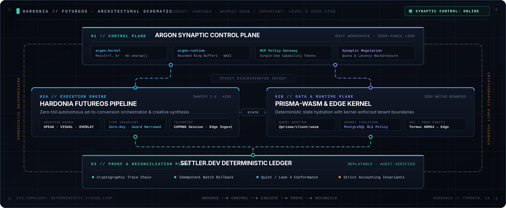

<div align="center">



<br />

[](#what-i-build)
[](#architecture-at-a-glance)
[](#about)
[](https://www.linkedin.com/in/scottrmhardie/)

# Scott Hardie

### Senior Applied AI / Platform Engineer · Distributed Systems · Enterprise Architecture

Toronto, Canada · [LinkedIn](https://www.linkedin.com/in/scottrmhardie/) · [Email](mailto:scottrmhardie@gmail.com?subject=Role%20or%20systems%20conversation)

> I build the systems around foundation models that make them safe to operate: policy-gated tool execution, tenant-isolated data, measurable inference cost, observable workflows, and evidence you can replay.

**Target roles:** Senior/Staff Applied AI Engineer · AI Platform Engineer · Distributed Systems Engineer · Solutions Architect

**Interested in:** teams shipping high-assurance AI, developer platforms, agent infrastructure, and enterprise-scale systems.

`APPLIED AI` · `DISTRIBUTED SYSTEMS` · `MCP` · `POSTGRESQL RLS` · `eBPF SANDBOXING` · `FORMAL VERIFICATION`

</div>

---

## Why I am a strong engineering hire

- **I bridge architecture and implementation.** I can align stakeholders on a system boundary, then build the Go, Rust, TypeScript, Python, database, and CI pieces that make the boundary real.
- **I treat AI as a production systems problem.** Models are useful; the surrounding controls determine whether a system is reliable, secure, affordable, and supportable.
- **I make claims inspectable.** My public work includes specifications, benchmarks, negative security tests, formal models, conformance vectors, and CI quality gates—not just screenshots or demos.
- **I understand enterprise delivery.** My work spans customer-facing architecture, identity and data integrations, institutional security, procurement conversations, and the operational constraints that decide whether a system ships.

## What I build

| Area | How I approach it | Public proof & releases |
| --- | --- | --- |
| **AI platform and agent infrastructure** | Keep the model unprivileged; put capability discovery, authorization, retries, budgets, and side effects behind explicit services. | [ReadyLayer](https://github.com/Hardonian/ReadyLayer) · [FORGE (`v1.0.0`)](https://github.com/Hardonian/FORGE) · [agent-infra](https://github.com/Hardonian/agent-infra) |
| **ML infrastructure and compiler quality** | Turn numerical discrepancies into minimized, reproducible, portable evidence for JAX/OpenXLA investigations. | [XLAxiom](https://github.com/Hardonian/XLAxiom) |
| **Secure multi-tenant & kernel systems** | Enforce tenant boundaries in the database kernel with PostgreSQL RLS and isolate untrusted execution with ZK-proved eBPF sandboxes. | [Settler (`v1.8.0`)](https://github.com/Hardonian/Settler) · [zerokernel (`v1.0.0`)](https://github.com/Hardonian/zerokernel) |
| **Inference economics and operations** | Measure tokens, latency, routing, and spend in sub-millisecond streams; use hard quotas and fallbacks to keep inference predictable. | [TokenGoblin](https://github.com/Hardonian/TokenGoblin) · [TokPulse (`v3.0.0`)](https://github.com/Hardonian/TokPulse) |
| **Reliable distributed execution** | Specify state transitions, backpressure, ordering, and capability rules; validate implementations against Quint formal models. | [veridag](https://github.com/Hardonian/veridag) · [argon-engine (`v1.0.0`)](https://github.com/Hardonian/argon-engine) |
| **Formal methods and automated reasoning** | Combine exact computation, SAT solving, counterexample search, and Lean 4 kernel-checked witnesses. | [GRAPH-Lab](https://github.com/Hardonian/GRAPH-Lab) · [SAT-Frontier (`v0.2.9`)](https://github.com/Hardonian/SAT-Frontier) |

## Start here

If you are reviewing this profile for a role, these are the fastest paths to signal:

- **[Flagship portfolio](#what-i-build)** — systems spanning ML infrastructure, AI governance, LLM FinOps, distributed execution, enterprise data, and formal methods.
- **[Architecture and technical writing](#technical-writing)** — how I reason about production AI beyond model selection.
- **[Working stack](#working-stack)** — the languages, data systems, inference tooling, and infrastructure I use.
- **[About and contact](#about)** — current role, enterprise background, and the best way to reach me.

---

## Architecture at a glance

Production AI needs deterministic boundaries around probabilistic components. The model proposes; typed policy services decide what may happen; execution systems perform only authorized work; evidence makes the result inspectable.

<div align="center">



</div>

> **Intelligence can be probabilistic. Infrastructure cannot.**

### Engineering principles

- **Evidence over confidence:** if a run cannot be inspected or replayed, it is not production-ready.
- **Determinism at the edges:** keep probabilistic behavior inside explicit schemas, policies, state machines, and execution limits.
- **Security in the kernel:** enforce tenant isolation and authorization where a missed application check cannot bypass them.
- **Boring reliability wins:** idempotency, retries, observable queues, and clear failure paths beat hidden cleverness.
- **Cost is a correctness constraint:** runaway inference spend is an operational failure, not merely a finance problem.

<details>
<summary><strong>Production failure modes &amp; kernel mitigations</strong></summary>

<br />

| Failure Mode | Why Naïve Wrappers Fail | Hardonia Kernel / Protocol Mitigation | Public Proof |
| --- | --- | --- | --- |
| **Prompt-injected cross-tenant read/write** | Application-layer `WHERE tenant_id = ?` filters can be omitted by generated queries or bypassed by tool bugs. | Session-scoped JWT claims enforced directly in the PostgreSQL kernel via `FORCE ROW LEVEL SECURITY` and verified by automated negative tests. | [Settler](https://github.com/Hardonian/Settler) · [RLS Note](OPENAI_CAMPAIGN/content/01_safe_multi_tenant_ai_agents_postgres_rls.md) |
| **Unauthorized tool execution &amp; privilege creep** | Giving the model direct API credentials lets an injected prompt invoke destructive side effects. | Unprivileged planner emits typed intent; an external MCP policy gateway validates capability scope and mints single-use approval tokens. | [ReadyLayer](https://github.com/Hardonian/ReadyLayer) · [MCP Note](OPENAI_CAMPAIGN/content/02_enterprise_tool_calling_authorization_outside_model.md) |
| **Runaway agent loops &amp; unmeasured token spend** | Retries and multi-step tool loops compound latency and cost before billing alerts fire. | Sub-millisecond token ingestion, tenant-level hard quota circuit breakers, and deterministic fallback model routing. | [TokenGoblin](https://github.com/Hardonian/TokenGoblin) · [TokPulse](https://github.com/Hardonian/TokPulse) |
| **Out-of-order distributed state mutation** | Concurrent workers and network retries violate causal ordering when state transitions are implicit. | Quint state-machine specifications, capability-checked causal DAG transitions, and cross-language conformance test vectors. | [veridag](https://github.com/Hardonian/veridag) · [argon-engine](https://github.com/Hardonian/argon-engine) |
| **Silent compiler numerical divergence** | Floating-point discrepancies inside large JAX/OpenXLA graphs are intractable to debug manually. | Automated HLO graph delta-minimization that isolates minimal, portable numerical reproducers. | [XLAxiom](https://github.com/Hardonian/XLAxiom) |
| **Unverified mathematical or algorithmic claims** | Heuristic search scripts can misreport extremal bounds without machine-checked proof obligations. | Python counterexample search and SAT solving paired with Lean 4 kernel-verified proof witnesses (`Zero Axioms`). | [GRAPH-Lab](https://github.com/Hardonian/GRAPH-Lab) · [SAT-Frontier](https://github.com/Hardonian/SAT-Frontier) |

</details>

---

## Proof-backed systems

These four repositories are the most representative public evidence of how I work. The table is generated from a [versioned manifest](profile-projects.json), checked against GitHub weekly, and separates released, beta, and research work.

<!-- profile-projects:start -->
_Public project metadata last verified **2026-11-06** · [source manifest](profile-projects.json) · [verification policy](CONTRIBUTING.md#project-metadata)_

| Project | Problem | Public evidence |
| --- | --- | --- |
| **[TokenGoblin](https://github.com/Hardonian/TokenGoblin)** · Go<br />Measure · `beta`<br />[](https://github.com/Hardonian/TokenGoblin/actions/workflows/ci.yml) | LLM workloads need cost, usage, and routing data before teams can control inference spend. | Public ingestion benchmarks, cost and routing tests, and a repository-level CI workflow.<br />[Architecture](https://github.com/Hardonian/TokenGoblin/blob/main/docs/ARCHITECTURE_AND_SPEC.md) · [Evidence](https://github.com/Hardonian/TokenGoblin/blob/main/internal/ingestion/benchmark_test.go) |
| **[ReadyLayer](https://github.com/Hardonian/ReadyLayer)** · TypeScript<br />Govern · `beta`<br />[](https://github.com/Hardonian/ReadyLayer/actions/workflows/security-gates.yml) | AI-assisted delivery needs policy, review, and evidence before generated changes reach production. | Public policy contracts, evidence export documentation, test suites, and CI quality gates.<br />[Architecture](https://github.com/Hardonian/ReadyLayer/blob/main/docs/runner/ARCHITECTURE.md) · [Evidence](https://github.com/Hardonian/ReadyLayer/blob/main/docs/EVIDENCE.md) |
| **[veridag](https://github.com/Hardonian/veridag)** · Rust<br />Prove · `research`<br />[](https://github.com/Hardonian/veridag/actions/workflows/formal.yml) | Distributed execution needs explicit ordering, capability security, and cross-language conformance. | A public protocol specification, Quint formal models, test vectors, and dedicated conformance workflows.<br />[Architecture](https://github.com/Hardonian/veridag/blob/main/docs/architecture.md) · [Evidence](https://github.com/Hardonian/veridag/blob/main/formal/README.md) |
| **[Settler](https://github.com/Hardonian/Settler)** · TypeScript<br />Reconcile · `stable`<br />[](https://github.com/Hardonian/Settler/actions/workflows/security.yml) | Payment, banking, and operational records diverge unless matching and evidence rules are explicit. | Multi-tenant reconciliation engine v1.8.0, 20+ CI gates, public benchmark suite, and cryptographically verified release artifacts.<br />[Architecture](https://github.com/Hardonian/Settler/blob/main/docs/ARCHITECTURE.md) · [Evidence](https://github.com/Hardonian/Settler/blob/main/benchmarks/reconciliationBenchmark.ts) |
<!-- profile-projects:end -->

<div align="center">

[](https://github.com/Hardonian/Hardonian/actions/workflows/profile-ci.yml)

</div>

---

## Technical writing

I publish architecture notes that are grounded in the systems above:

1. **[Building Safe Multi-Tenant AI Agents with Postgres RLS](OPENAI_CAMPAIGN/content/01_safe_multi_tenant_ai_agents_postgres_rls.md)** — why application-level filtering fails in autonomous workflows, and how to enforce tenant boundaries in PostgreSQL.
2. **[Enterprise Tool Calling: Why Authorization Belongs Outside the Model](OPENAI_CAMPAIGN/content/02_enterprise_tool_calling_authorization_outside_model.md)** — policy-gated MCP reverse proxies, unprivileged planners, and single-use approval tokens.
3. **[From Prototype to Production: Architecture for Enterprise AI Agents](OPENAI_CAMPAIGN/content/03_from_prototype_to_production_enterprise_agents.md)** — model abstraction, execution boundaries, CI evaluations, observability, and token-spend governance.
4. **[Hardonia Architecture Playbook](architecture-playbook/README.md)** — system topology, bounded contexts, operating loops, and evidence verification.

---

## Working stack

<div align="center">

**Languages & systems**<br />


<br />

**Data, security & observability**<br />


<br />

**AI, agents & infrastructure**<br />


</div>

<details>
<summary><strong>Local compute and inference lab</strong></summary>

I run a private, owned testbed for local model routing, quantized inference, image/video workflows, and failure-mode testing. The hardware includes an AMD EPYC 7452 server, AMD Ryzen AI 9 HX370 NPU/GPU compute, NVIDIA V100/P40/RTX 3060 accelerators, Ollama-compatible routing, ComfyUI, containers, and Prometheus/Grafana-style observability.

Public implementation lives primarily in [model-tools](https://github.com/Hardonian/model-tools), [autopilot](https://github.com/Hardonian/autopilot), and [api-tools](https://github.com/Hardonian/api-tools).

</details>

<details>
<summary><strong>Verify the profile locally</strong></summary>

```bash
git clone https://github.com/Hardonian/Hardonian.git
cd Hardonian
uv run python -m unittest discover tests -v
uv run python scripts/profile-metadata.py --check --verify-remote
uv run python scripts/profile-link-audit.py
```

The checks reject stale project metadata, missing public evidence, broken local assets, and dead links.

</details>

---

## About

I am a **Solutions Architect at McGraw Hill** and build Hardonia independently from Toronto. My work combines enterprise architecture and hands-on systems implementation: customer-facing technical strategy, distributed control planes, formal models, production TypeScript applications, and PostgreSQL isolation.

I also contribute part-time expertise to confidential frontier-AI evaluation and systems initiatives; client, model, dataset, and internal research details remain private.

Selected background:

- Enterprise integrations across identity providers, message buses, LMS/SIS/ERP platforms, and legacy data exchanges.
- Working knowledge of LTI 1.3 Advantage, OneRoster 1.2, OAuth 2.0, Keycloak OIDC, SCIM, MCP, and OpenTelemetry trace propagation.
- Institutional security and compliance conversations, including FERPA and SOC 2 requirements.
- President's Award for Sales Excellence, reflecting the ability to turn difficult technical work into customer and business outcomes.

---

## Let’s talk

Hiring managers and recruiting teams: the best way to reach me is [LinkedIn](https://www.linkedin.com/in/scottrmhardie/) or [email](mailto:scottrmhardie@gmail.com?subject=Role%20or%20systems%20conversation). I am especially interested in roles where I can help turn ambitious AI capabilities into reliable platform primitives and shipped products.

If you are evaluating the engineering work first, start with [TokenGoblin](https://github.com/Hardonian/TokenGoblin), [ReadyLayer](https://github.com/Hardonian/ReadyLayer), [veridag](https://github.com/Hardonian/veridag), or [Settler](https://github.com/Hardonian/Settler), then follow the architecture links in each project.

<div align="center">

[](https://www.linkedin.com/in/scottrmhardie/)
[](mailto:scottrmhardie@gmail.com?subject=Role%20or%20systems%20conversation)

<br />

<sub>Hardonia · local compute · deterministic control · verifiable outcomes</sub>

</div>
