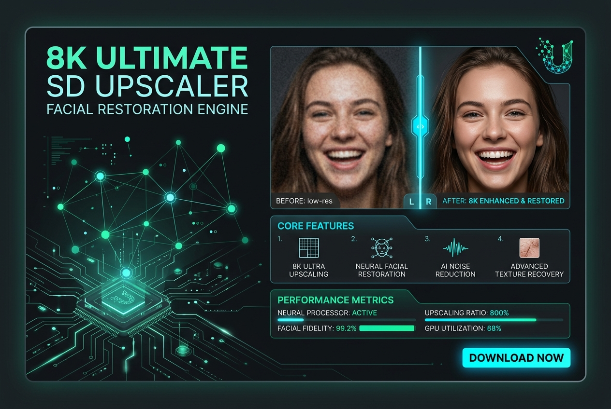

# 8K Ultimate SD Upscaler & Facial Restoration Engine

Multi-tile high-fidelity upscaler that adds genuine micro-textures without plastic smoothing

**Price:** $49 niche pack / $119 studio pack

## Pain

Standard upscalers either blur images into plastic mush or hallucinate bizarre, creepy geometric artifacts across faces and textures.

## Deliverable

Validated ComfyUI API workflow graph, zero-code Python CLI runner, turnkey FastAPI REST microservice, 1-click model downloaders, VRAM optimization profiles (6GB–24GB+), and pre-flight diagnostics.

**Requirements:** Tested on 8GB+ VRAM (optimized for RTX 3060/4070/4090).

## Checkout / Buy

- [Purchase 8K Ultimate SD Upscaler & Facial Restoration Engine via Stripe](https://buy.stripe.com/upscale-8k-pack)

- [Purchase 8K Ultimate SD Upscaler & Facial Restoration Engine via Gumroad](https://scottrmhardie.gumroad.com/l/upscale-8k)

---

[View source product page in Scott Hardie's Profile README](https://github.com/Hardonian/Hardonian)
