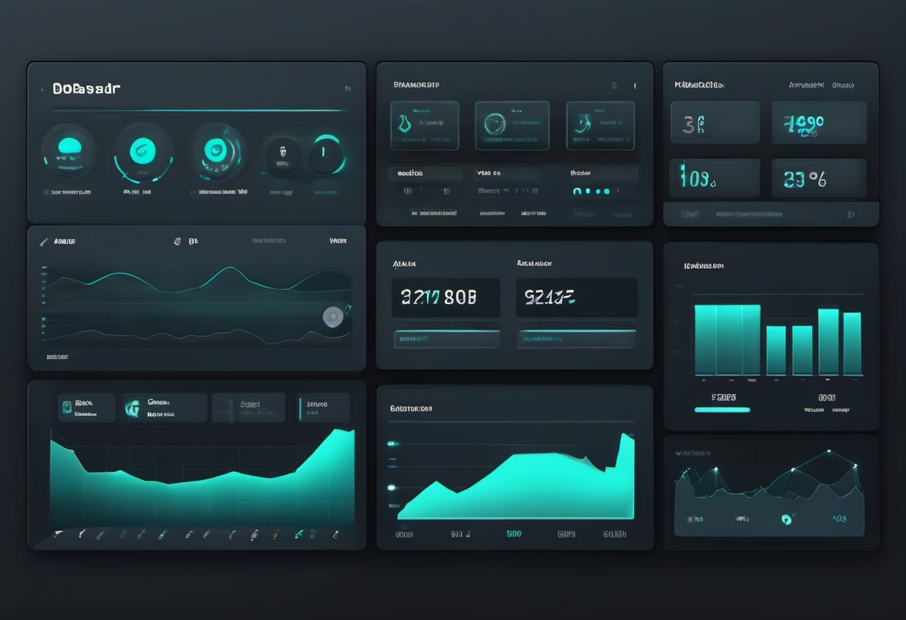

# AI Command Center Setup

A local dashboard that tells you what is broken, what to fix first, and what is making money.

**Price:** $297 lifetime template / $29-mo managed checks / $997 done-for-you

## Pain

They have tools, but no operator layer, no health history, no priority queue, and no revenue filter.

## Deliverable

Installable local FastAPI dashboard, verify script, systemd service, browser smoke, runbook.

## Checkout / Buy

- [Stripe checkout](https://buy.stripe.com/9B68wO57qbCc7kSeGZb3q0j)

---

Source product page in repo: [Hardonian README](https://github.com/Hardonian/Hardonian)
