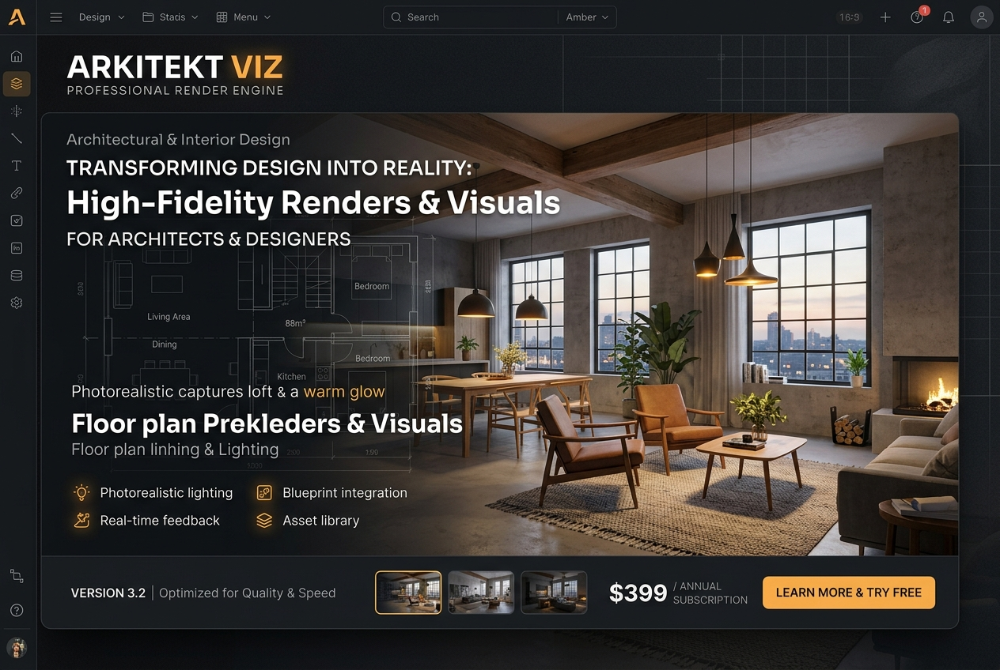

# Architectural & Interior Design Pro Suite

Multi-pass ControlNet Depth & Canny structural fidelity for interior designers and architects

**Price:** $59 niche pack / $149 studio pack

## Pain

Generic diffusion models warp straight walls, hallucinate impossible perspective, float furniture mid-air, and duplicate objects on wide angle shots.

## Deliverable

Validated ComfyUI API workflow graph, zero-code Python CLI runner, turnkey FastAPI REST microservice, 1-click model downloaders, VRAM optimization profiles (6GB–24GB+), and pre-flight diagnostics.

**Requirements:** Tested on 8GB+ VRAM (optimized for RTX 3060/4070/4090).

## Checkout / Buy

- [Purchase Architectural & Interior Design Pro Suite via Stripe](https://buy.stripe.com/arch-interior-pack)

- [Purchase Architectural & Interior Design Pro Suite via Gumroad](https://scottrmhardie.gumroad.com/l/arch-interior)

---

[View source product page in Scott Hardie's Profile README](https://github.com/Hardonian/Hardonian)
