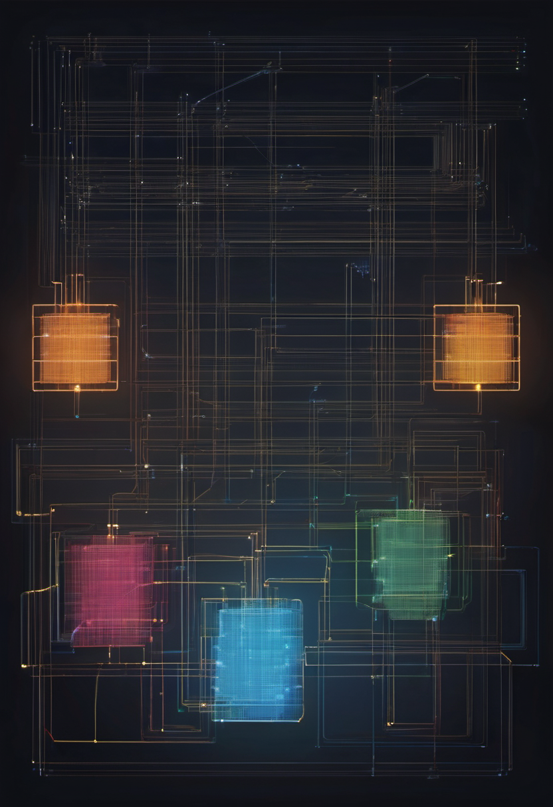

# ComfyUI Node Starter Kit

A sellable starter template for shipping custom ComfyUI nodes without starting from zero.

**Price:** $39 lite / $99 commercial

## Pain

People want to sell small ComfyUI utilities but do not have a clean node-pack scaffold, docs, or packaging flow.

## Deliverable

Working node-pack scaffold, example utility nodes, packaging layout, install notes, test/import commands, sales copy.

## Checkout / Buy

- [Purchase ComfyUI Node Starter Kit via Stripe](https://buy.stripe.com/9B6cN41Veay8eNkfL3b3q0m)

- [Gumroad](https://scottrmhardie.gumroad.com/l/cauzzx)

---

Source product page in repo: [Scott Hardie's Profile README](https://github.com/Hardonian/Hardonian)
