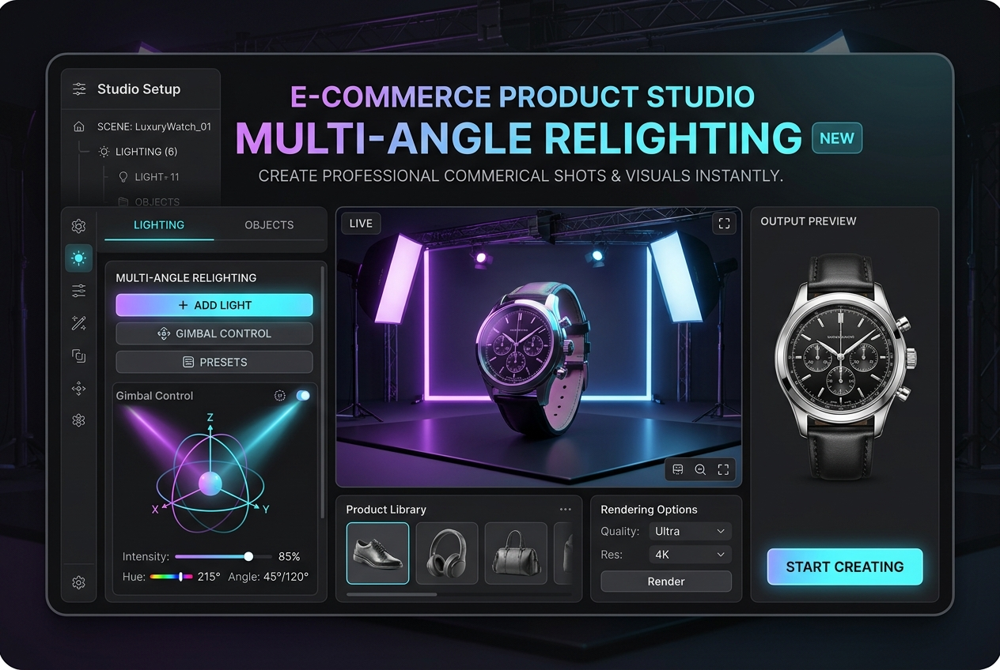

# E-Commerce Commercial Product Studio & Relighting

Turn flat smartphone product photos into luxury commercial billboard studio renders with IC-Light

**Price:** $59 niche pack / $129 studio pack

## Pain

Photoshop compositing takes hours per image and always looks fake because ambient light, bounce shadows, and rim highlights don't match the background.

## Deliverable

Validated ComfyUI API workflow graph, zero-code Python CLI runner, turnkey FastAPI REST microservice, 1-click model downloaders, VRAM optimization profiles (6GB–24GB+), and pre-flight diagnostics.

**Requirements:** Tested on 8GB+ VRAM (optimized for RTX 3060/4070/4090).

## Checkout / Buy

- [Purchase E-Commerce Commercial Product Studio & Relighting via Stripe](https://buy.stripe.com/cNibJ057q21C34C7exb3q0n)

- [Purchase E-Commerce Commercial Product Studio & Relighting via Gumroad](https://scottrmhardie.gumroad.com/l/cqfiev)

---

[View source product page in Scott Hardie's Profile README](https://github.com/Hardonian/Hardonian)
