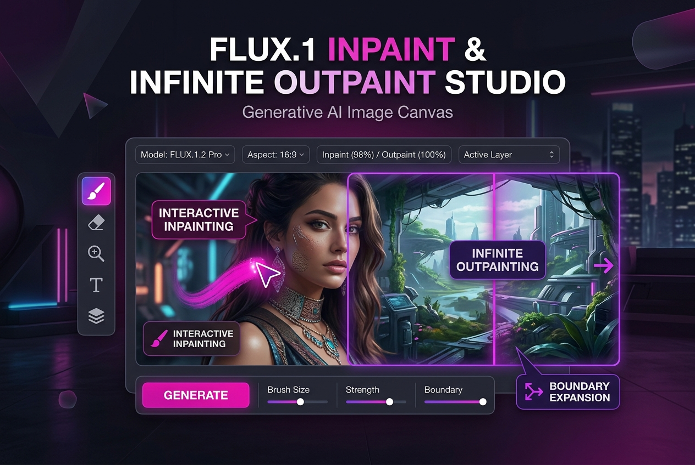

# Flux.1 Fill Infinite Inpainting & Outpainting Pro

Seamless generative fill and infinite canvas expansion powered by Flux.1 Fill Dev

**Price:** $49 niche pack / $119 studio pack

## Pain

Inpainting with standard models leaves visible boundary seams, blurry edges, mismatched color temperatures, and unnatural texture transitions.

## Deliverable

Validated ComfyUI API workflow graph, zero-code Python CLI runner, turnkey FastAPI REST microservice, 1-click model downloaders, VRAM optimization profiles (6GB–24GB+), and pre-flight diagnostics.

**Requirements:** Tested on 8GB+ VRAM (optimized for RTX 3060/4070/4090).

## Checkout / Buy

- [Purchase Flux.1 Fill Infinite Inpainting & Outpainting Pro via Stripe](https://buy.stripe.com/flux-fill-pack)

- [Purchase Flux.1 Fill Infinite Inpainting & Outpainting Pro via Gumroad](https://scottrmhardie.gumroad.com/l/flux-fill)

---

[View source product page in Scott Hardie's Profile README](https://github.com/Hardonian/Hardonian)
