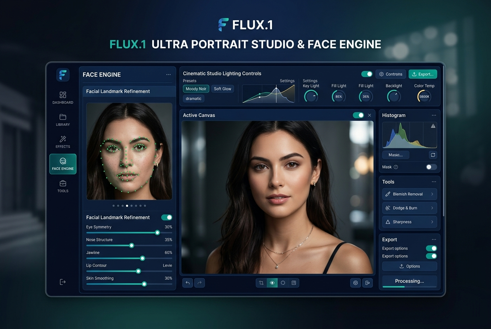

# Flux.1 Ultra Portrait Studio & Face Engine

Hollywood-grade photorealistic portrait synthesis, skin pore refinement & background isolation

**Price:** $59 niche pack / $149 studio pack

## Pain

Standard Flux workflows output plasticky skin, blow out specular highlights, and choke on 12GB VRAM. Worse, trying to isolate hair strands or preserve facial identity across shots requires wiring 30+ fragile custom nodes.

## Deliverable

Validated ComfyUI API workflow graph, zero-code Python CLI runner, turnkey FastAPI REST microservice, 1-click model downloaders, VRAM optimization profiles (6GB–24GB+), and pre-flight diagnostics.

**Requirements:** Tested on 8GB+ VRAM (optimized for RTX 3060/4070/4090).

## Checkout / Buy

- [Purchase Flux.1 Ultra Portrait Studio & Face Engine via Stripe](https://buy.stripe.com/cNibJ057q21C34C7exb3q0n)

- [Purchase Flux.1 Ultra Portrait Studio & Face Engine via Gumroad](https://scottrmhardie.gumroad.com/l/flux-portrait)

---

[View source product page in Scott Hardie's Profile README](https://github.com/Hardonian/Hardonian)
