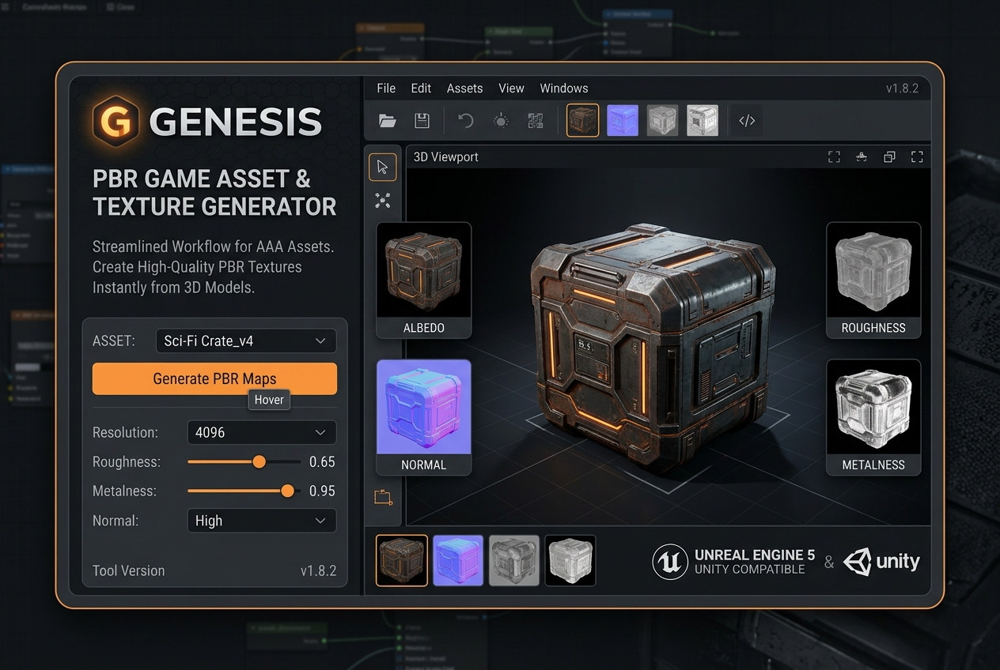

# Game Asset 3D Mesh & PBR Texture Synthesizer

Generate textured 3D OBJ meshes, normal maps, and roughness maps directly from 2D concept art

**Price:** $69 niche pack / $169 studio pack

## Pain

3D artists spend days modeling, UV-unwrapping, and painting PBR maps for secondary background props and concept assets.

## Deliverable

Validated ComfyUI API workflow graph, zero-code Python CLI runner, turnkey FastAPI REST microservice, 1-click model downloaders, VRAM optimization profiles (6GB–24GB+), and pre-flight diagnostics.

**Requirements:** Tested on 8GB+ VRAM (optimized for RTX 3060/4070/4090).

## Checkout / Buy

- [Purchase Game Asset 3D Mesh & PBR Texture Synthesizer via Stripe](https://buy.stripe.com/game-3d-asset-pack)

- [Purchase Game Asset 3D Mesh & PBR Texture Synthesizer via Gumroad](https://scottrmhardie.gumroad.com/l/game-3d-asset)

---

[View source product page in Scott Hardie's Profile README](https://github.com/Hardonian/Hardonian)
