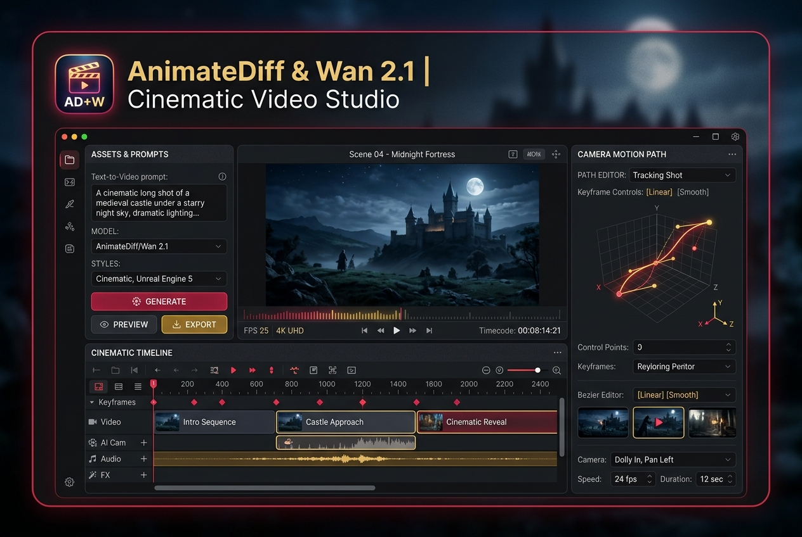

# AI Cinema & High-FPS Video Production Suite

Multi-stage video generation with Wan 2.1, LTX-Video, 60fps RIFE interpolation and 4K upscale

**Price:** $79 niche pack / $199 studio pack

## Pain

AI video is notorious for jerky camera motion, temporal morphing, low framerates (12-16 fps), and exploding GPU memory past frame 40.

## Deliverable

Validated ComfyUI API workflow graph, zero-code Python CLI runner, turnkey FastAPI REST microservice, 1-click model downloaders, VRAM optimization profiles (6GB–24GB+), and pre-flight diagnostics.

**Requirements:** Tested on 8GB+ VRAM (optimized for RTX 3060/4070/4090).

## Checkout / Buy

- [Purchase AI Cinema & High-FPS Video Production Suite via Stripe](https://buy.stripe.com/video-cinema-pack)

- [Purchase AI Cinema & High-FPS Video Production Suite via Gumroad](https://scottrmhardie.gumroad.com/l/video-cinema)

---

[View source product page in Scott Hardie's Profile README](https://github.com/Hardonian/Hardonian)
