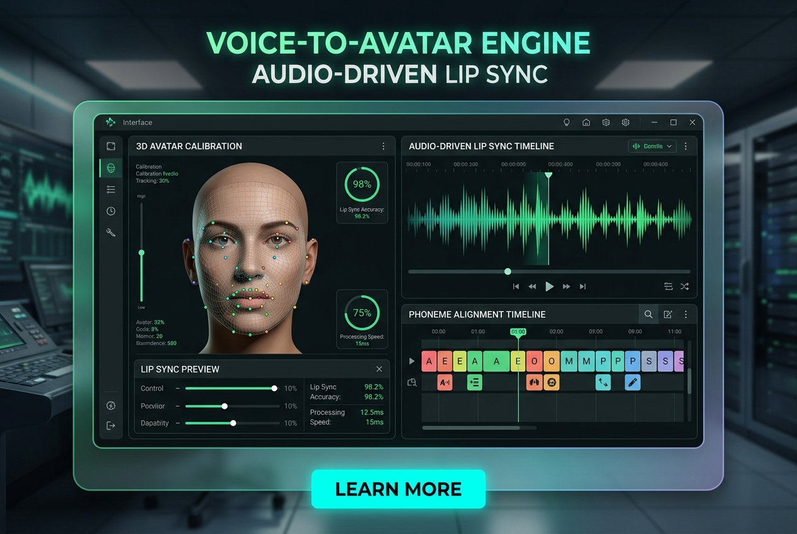

# Voice-to-Avatar AI Presenter & Lip-Sync Studio

Animate static portrait photos with voice audio files into realistic talking avatars with auto-captioning

**Price:** $59 niche pack / $149 studio pack

## Pain

Voice-synced avatars look robotic and dead-eyed, with out-of-sync audio, jittery neck seams, and painful setup requirements across disparate Python tools.

## Deliverable

Validated ComfyUI API workflow graph, zero-code Python CLI runner, turnkey FastAPI REST microservice, 1-click model downloaders, VRAM optimization profiles (6GB–24GB+), and pre-flight diagnostics.

**Requirements:** Tested on 8GB+ VRAM (optimized for RTX 3060/4070/4090).

## Checkout / Buy

- [Purchase Voice-to-Avatar AI Presenter & Lip-Sync Studio via Stripe](https://buy.stripe.com/voice-avatar-pack)

- [Purchase Voice-to-Avatar AI Presenter & Lip-Sync Studio via Gumroad](https://scottrmhardie.gumroad.com/l/voice-avatar)

---

[View source product page in Scott Hardie's Profile README](https://github.com/Hardonian/Hardonian)
